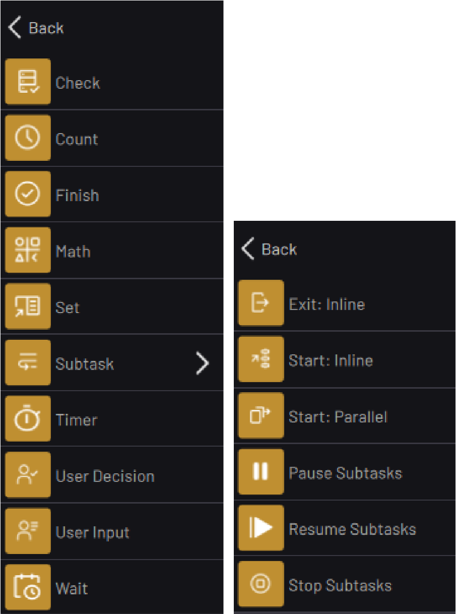

# Canvas Blocks

The Canvas blocks include Check, Count, Finish, Math, Set, Timer, User Decision, User Input, Wait, and Subtask blocks. The Subtask blocks allow for multitasking with subtasks. They include, Exit, Start, Pause, Resume, and Stop.

