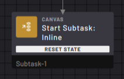
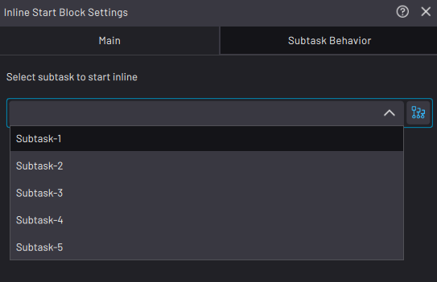
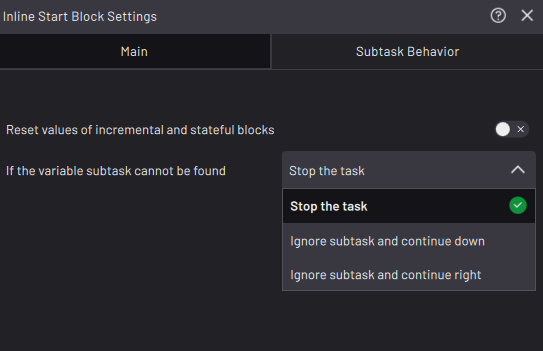

# Subtask \> Start Subtask: Inline Block

The Start Subtask: Inline block starts an inline subtask of your choice.

When the block is executed, execution enters and starts the inline subtask.

If the inline subtask executes an Exit block, the task returns to the Start Subtask: Inline block and follows the path set in the Exit block.

If you don't include an Exit block in the inline subtask, the subtask and the calling task finish after executing the last available block.

In the block settings, use the dropdown selector or variable selector in the **Main** tab to select which inline subtask to start.

Calling a subtask from a string or integer variable provides flexibility for having this block call whichever subtask has a name that corresponds to the current variable value. For example, if this block calls a string variable named “Variable-1” and a Set block before it sets Variable-1 to “Subtask-1”, this block will call Subtask-1.

In the **Subtask Behavior** tab, enable the toggle next to **Reset values of incremental and stateful blocks** to reset all blocks in the subtask before it starts to execute. This resets Count, Timer, Grid, and other state-based blocks before the subtask executes again.

---

If you are calling a subtask from a string or integer variable, select what happens when the variable subtask cannot be found. You can **Stop the task** \(to stop the task as soon as the flowchart encounters the invalid subtask\) or **Ignore subtask and continue down/right** \(to continue the task down the bottom or right paths\).

[Back to Canvas Block Overview](Canvas-Overview.md)
