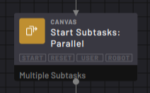
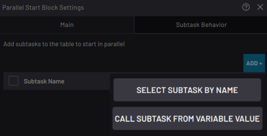
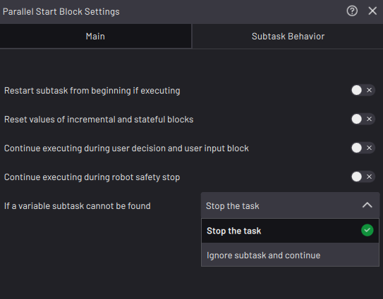

# Subtask \> Start Subtasks: Parallel Block

The Start Subtasks: Parallel block starts one or more parallel subtasks of your choice.

When the block is executed, the parallel subtasks start execution while the task continues along the bottom path.

The subtasks you start execute at the same time as the Main Task until you stop it or until the subtasks reach final blocks.

In the **Main** tab of the block settings, tap **ADD +** to select which parallel subtasks to start.

Calling a subtask from a string or integer variable provides flexibility for having this block call whichever subtask has a name that corresponds to the current variable value. For example, if this block calls a string variable named “Variable-1” and a Set block before it sets Variable-1 to “Subtask-1”, this block will call Subtask-1.

In the **Subtask Behavior** tab, enable the toggles to:

-   Restart the subtasks if they were running when this block executes.
-   Reset the state of counting blocks \(like Count and Grid\) before the subtask executes again.
-   Ignore pauses during User Decision and User Input blocks \(or continue the subtask even when a pause takes place in another subtask\).
-   Ignore pauses during robot safety stops \(or continue the subtask even when a robot safety stop occurs\).

---

If you are calling a subtask from a string or integer variable, select what happens when a variable subtask cannot be found. You can **Stop the task** \(to stop the task as soon as the flowchart encounters an invalid subtask\) or **Ignore subtask and continue** \(to only ignore the invalid subtasks but still execute any valid subtasks\).

