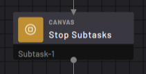
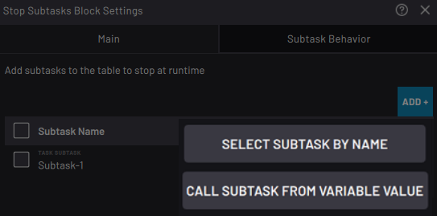

# Subtask \> Stop Subtasks Block

The Stop Subtasks block stops one or more selected subtasks and immediately continues along the bottom path.

|Use this block to stop subtasks from another subtask when they no longer need to run.

For example, you may stop a subtask that runs a conveyor if you run out of parts.

||

|In the block settings, tap **ADD +** to select the subtasks to stop.

 Calling a subtask from a string or integer variable provides flexibility for having this block call whichever subtask has a name that corresponds to the current variable value. For example, if this block calls a string variable named “Variable-1” and a Set block before it sets Variable-1 to “Subtask-1”, this block will call Subtask-1.

||

|**Note:** If you are calling a subtask from a string or integer variable, select what happens when a variable subtask cannot be found. You can **Stop the task** \(to stop the task as soon as the flowchart encounters an invalid subtask\) or **Ignore subtask and continue** \(to only ignore the invalid subtasks but still execute any valid subtasks\).

||

**Parent topic:**[Canvas Blocks](../TaskCanvasBlockGlossary/Canvas-Overview.md)

