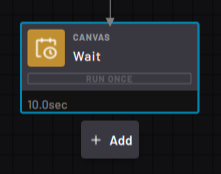
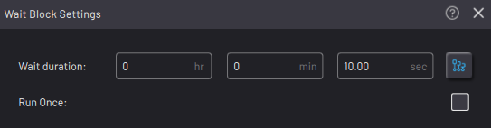
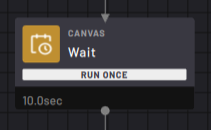

# Wait Block

The Wait block pauses execution for a defined length of time.

|When the Wait block is executed, the count down begins. When the Wait block ends, the task continues through the bottom path.

By default, the countdown resets to the defined length of time after it reaches zero. The next time you execute the Wait, it starts the countdown over.

||

|In the Wait Block Settings, choose the Wait duration. Leave the Run Once checkbox checked or unchecked.

||

|When the Run Once checkbox is checked, the Wait countdown runs only the first time you execute the block.

||

**Parent topic:**[Canvas Blocks](../TaskCanvasBlockGlossary/Canvas-Overview.md)

