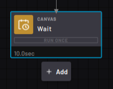

# Zero Sensor Block

|The Zero Sensor block zeroes or biases the sensor when it executes. There are no editable settings.

||

**Parent topic:**[Force Sensor Blocks](../TaskCanvasBlockGlossary/Device-ForceSensor.md)

