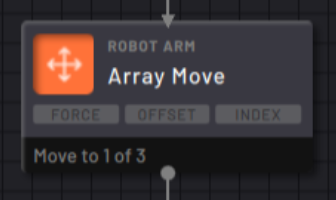
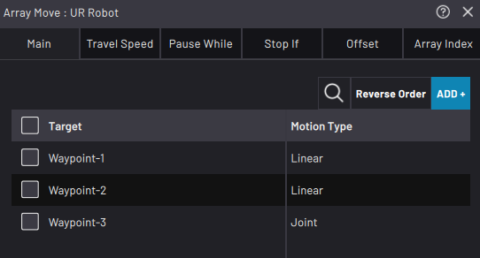
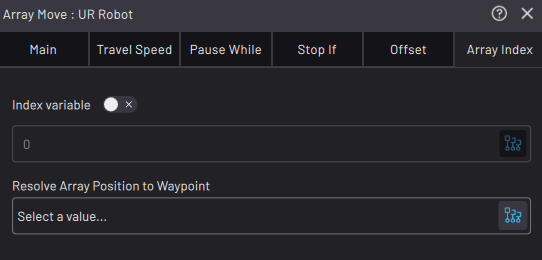

# Array Move Block

The Array Move specifies a custom list of waypoints that the robot moves to, one at a time, each time the block executes.

In the **Main** tab, the Target table shows the list of targets that the robot moves to during the Array Move. The order that the robot visits these targets is the order they appear in the table. After the robot has moved through all the positions, it starts over from the top.

Tap **ADD +** to select a waypoint to add to the table. From the dropdown, select a new or existing waypoint.

In the **Array Index** tab, customize the indexing behavior. The **Index Variable** field is where you choose an integer variable to decide which index the Array Move moves to when it executes. When you use an index variable, your task must update the variable with other blocks.

Choose a waypoint in the **Resolve Array Position to Waypoint** field to update that waypoint with the next array position each time the block executes.

:::note
When there is a waypoint in the Resolve field, the Array block does **not** move the robot. It saves the chosen waypoint at the grid position. Then you may use this waypoint in other move blocks, like the Continuous Move. Execute the Array Move block to update the waypoint with the next position in the list.
:::

See [Robot Command Blocks](Robot-Overview.md) for more info on the other block features.

