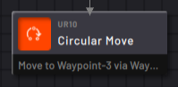
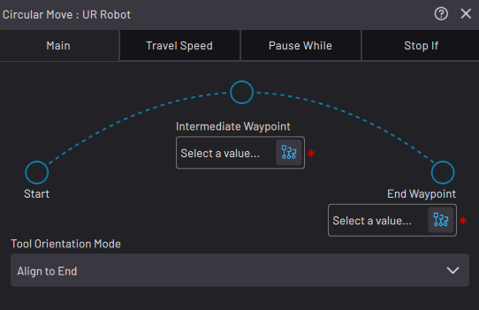

# Circular Move Block

|The Circular Move block performs an arc motion \(with a constant radius\) relative to the robot's position when the block executes.

In the **Main** tab, tap the **Intermediate Waypoint** and **End Waypoint** selectors to choose the waypoints that define those points on the arc.

||

**Note:** The block does not define a starting position, so the robot's position defines the arc when the block executes. The same block can execute different motions from different start positions.

|The Intermediate Waypoint cannot be at the same location as the Start or the End Waypoint.

**Note:** Forge/OS calculates circular moves using the TCP. You can only select Linear waypoints. You cannot select Joint waypoints.

||

Use the **Tool Orientation Mode** dropdown to choose how the tool moves through the arc. **Align to End** moves the Tool Center Point \(TCP\) through the arc, so it finishes the motion in the exact orientation of the End Waypoint. **Maintain Tangency** keeps the TCP orientation relative to the arc center point the same as the start position. If you select Maintain Tangency, the TCP's orientation at the end may be different than the End Waypoint orientation.

See [Robot Command Blocks](Robot-Overview.md) for more info on the other block features.

**Parent topic:**[Robot Command Blocks](../TaskCanvasBlockGlossary/Robot-Overview.md)

