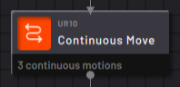

# Continuous Move Block

|The Continuous Move block performs a fluid and unbroken motion through all the programmed positions and relative motions.

Use a Continuous Move to program a motion that requires more than one move type or multiple points to define the motion.

||

|The **advantages** of using a Continuous Move are:

-   A cleaner Canvas: Instead of a complex motion with 10 waypoints requiring 10 Absolute Move blocks, a single Continuous Move block can contain all 10 waypoints.

-   Smoother and faster motion: The robot executes changes in direction more fluidly and doesn't need to come to a complete stop between targets.

||

|In the **Main** tab, the **Target** table shows the list of positions and motions that the robot executes.

Tap **ADD +** to select a motion to add to the table.

From the dropdown, select an option.

**Tip:** To program Grid or Array Moves into a Continuous Move, look for the **Resolve Position to Waypoint** feature in those block descriptions.

||

|Motion Type|Description|
|-----------|-----------|
|Absolute Move with New Waypoint|Create a new waypoint and add it to the table as an Absolute Move. Choose the motion type and set an offset.|
|Absolute Move with Existing Waypoint|Choose an existing waypoint and add it to the table as an Absolute Move. Choose the motion type and set an offset.|
|Relative Move|Program a relative motion using linear or joint values. The starting point of the relative motion is the previous position in the Target table.|
|Circular Move|Program a circular motion using an intermediate and end waypoint. The starting point of the circular motion is the position before it in the Target table.|

|After programming a motion, it appears in the table on the Main tab. Select a single target in the table to edit it or change its order using the **Up and Down arrows**.

To reverse the order of all targets, deselect all targets and tap **Reverse Order**. Use this when you want to duplicate and reverse a Continuous Move you programmed earlier.

||

To edit a target, select it on the table and tap **Edit**. You may edit one target at a time.

To remove one or more targets from the Continuous Move, select them and tap **Delete**.

To duplicate a target in the Continuous Move, select that target in the table and tap **Duplicate**.

In the **Travel Speed** tab, **Motion Smoothing** defines how much the robot attempts to smooth the transition between the motions. A large blend radius creates a more fluid motion, but it increases the curving near targets. A small blend radius creates longer, more precise motions to each target before changing directions.

See [Robot Command Blocks](Robot-Overview.md) for more info on the other block features.

**Parent topic:**[Robot Command Blocks](../TaskCanvasBlockGlossary/Robot-Overview.md)

