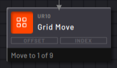
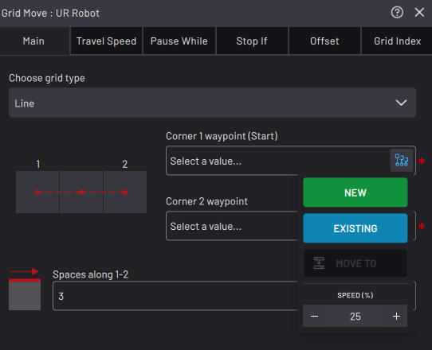
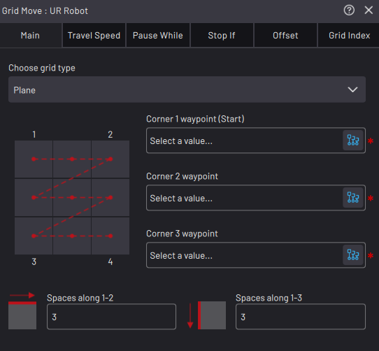
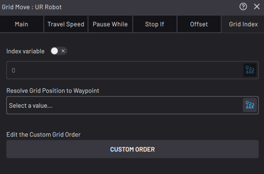
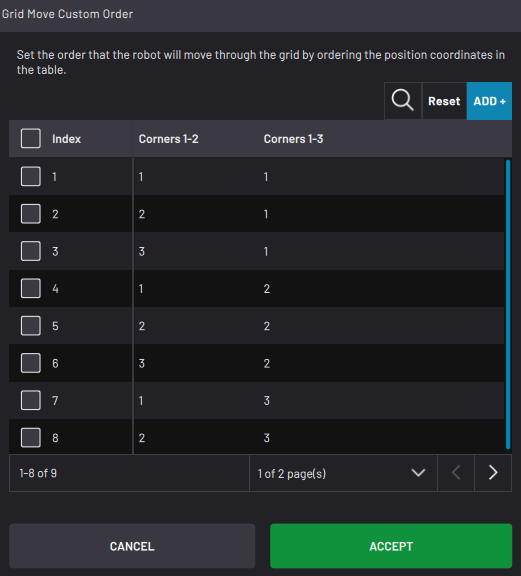
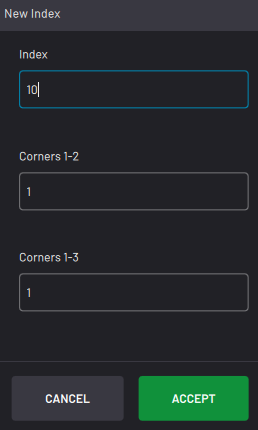

# Grid Move Block

The Grid Move block creates a repeating pattern of positions that the robot moves to, one at a time. Each time the block executes, the robot moves to the next position in the grid and then continues to the next block. This continues until the robot has moved to all the positions \(which prompts it to restart at the beginning of the grid\).

In the **Main** tab, choose the grid type from the dropdown, either **Line** \(one-dimensional\) or **Plane** \(two-dimensional\).

For a linear grid, choose the start and end waypoints and the number of positions along the line. The block fills in intermediate positions with equal spacing.

For a planar grid, choose the three corner waypoints and the number of positions between corners 1 and 2, and corners 1 and 3. Use the grid visualization to make sure your corners are in the correct positions. By default, the robot moves first along the row from corner 1 to corner 2, then starts the next row.

In the **Grid Index** tab, customize the indexing behavior of the Grid Move. The **Index Variable** field is where you choose an integer variable to decide which index the Grid Move moves to when it executes. When you use an index variable, your task must update the variable with other blocks.

Choose a waypoint in the **Resolve Grid Position to Waypoint** field to update that waypoint with the next grid position each time the block executes.

:::note
When there is a waypoint in the Resolve field, the grid block does **not** move the robot. It saves the chosen waypoint at that grid position. Then you may use this waypoint in other move blocks, like the Continuous Move. Execute the Grid Move block to update the waypoint with the next position in the grid.
:::

Tap **CUSTOM ORDER** to set the order that the robot moves through the grid. Select a position coordinate on the table and use the up and down arrows to move it earlier or later in the sequence.

Tap **Delete** at the top of the table to remove the selected position from the sequence.

Tap **Duplicate** to copy the selected position.

Tap **Edit** to enter a new row or column coordinate.

To add a new index, tap **ADD +**. Enter the Index and the row and column coordinates. By default, the Index field fills in as one integer value larger than the last table entry. If you type in a smaller value, the new entry is added at that order of the sequence. The existing position that used to have that index \(and everything after it\) are pushed down.

To undo your re-ordering, deletion, duplication, and coordinate changes, select none of the positions and tap **Reset** at the top of the table.

See [Robot Command Blocks](Robot-Overview.md) for more info on the other block features.

