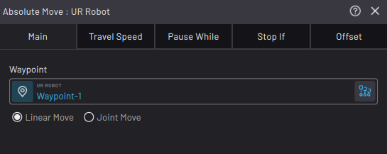

# Robot Command Blocks

The Robot Command blocks are available in the block menu for active robot devices. They include robot move blocks, robot IO blocks, and other robot command blocks.

All robot move blocks share a few common features:

|**The Main Tab**

Set waypoints and other robot motion parameters. Requirements vary based on the block.||

|**The TRY IT OUT Section**

Preview the move. Tap **STEP BLOCK** to move the robot to the set position. Drag the **Speed** slider to determine how fast the robot moves. Tap **RESET POSITION** to move the robot to the position it was in when you opened the block.||

|**The Travel Speed Tab**

Set the speed of the motion. Select in the dropdown how you want to define the speed. All robots have the option of defining speed by Overall Percent \(0%-100%\) of the robot’s maximum speed. Some robots also have the options of defining speed by precise parameters \(i.e., Time to Completion or some combination of Velocity, Acceleration, and Deceleration\).||

**Note:** If you define motion by velocity, acceleration, deceleration, or time to completion and then import the task to another robot that doesn't support those parameters, the block may show an error until you correct and save the block.

|**The Pause While Tab**

Set conditions that pause the block while all conditions are met or while any conditions are met. Enable the “**Pause block while conditions met**” toggle to use this feature. If this toggle is enabled, you must have conditions listed for the **ACCEPT** button to be available. Add conditions with the **ADD +** dropdown.

||

**Note:** If you have a force sensor listed in the robot's configuration in Device Configuration, enable the "**Force exceeded at end of arm sensor**" toggle. In the **Magnitude** field, set the force threshold that would pause the block.

|**The Stop If Tab**

Set conditions that stop the block while all conditions are met or while any conditions are met. When this occurs, the task proceeds down the block’s right path. Enable the “**Stop block and take right path if conditions met**” toggle to use this feature. If this toggle is enabled, you must have conditions listed for the **ACCEPT** button to be available. Add conditions with the **ADD +** dropdown.

||

**Note:** If you have a force sensor listed in the robot's configuration in Device Configuration, enable the "**Force exceeded at end of arm sensor**" toggle. In the **Magnitude** field, set the force threshold that would stop the block.

|**The Offset Tab**

Enable the Move to Offset toggle to offset the motion. An offset defines a relative position from the waypoint\(s\) to which the robot moves. Use the Frame dropdown to set the Frame in which the offset applies. Use the value fields to set the offset from the waypoint along the axes of that Frame.||

-   **[Robot I/O Blocks](../TaskCanvasBlockGlossary/Robot-IO.md)**  

-   **[Absolute Move Block](../TaskCanvasBlockGlossary/Robot-Absolute.md)**  

-   **[Relative Move Block](../TaskCanvasBlockGlossary/Robot-Relative.md)**  

-   **[Circular Move Block](../TaskCanvasBlockGlossary/Robot-Circular.md)**  

-   **[Continuous Move Block](../TaskCanvasBlockGlossary/Robot-Continuous.md)**  

-   **[Grid Move Block](../TaskCanvasBlockGlossary/Robot-Grid.md)**  

-   **[Array Move Block](../TaskCanvasBlockGlossary/Robot-Array.md)**  

-   **[Set TCP/Payload Block](../TaskCanvasBlockGlossary/Robot-SetTCPAndPayload.md)**  

**Parent topic:**[Block Glossary](../TaskCanvasBlockGlossary/BlockGlossaryOverview.md)

