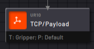
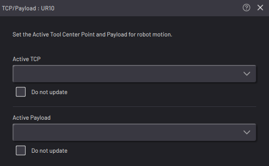

# Set TCP/Payload Block

The TCP/Payload block sets the robot's Active Tool Center Point \(TCP\) and Active Payload. While the task is running, the Active TCP and Payload stay as the values set until another TCP/Payload block is executed.

|**Note:** First add the TCPs and Payloads to a robot's configuration in Device Configuration.

||

|When you add a TCP/Payload block, choose whether or not to change the Active TCP and/or Active Payload.

Check the box labeled "**Do not update**" to maintain the active TCP or Payload at the time when the block executes.

||

|Use the dropdown menus to select the configured TCP and/or Payload you want the block to make active.

||

**Important:** When executing waypoint motion blocks, the **Active TCP** on the robot should match the TCP defined for that waypoint. If not, the position the robot moves to won't match the expected position. Use the TCP/Payload block in a task to update the Active TCP before moving to that waypoint.

**Important:** The **Active Payload** instructs the robot to account for the amount of inertia at the end-of-arm when it is moving. A mismatch between the expected payload \(Active Payload\) and actual payload at the end-of-arm can cause errors. Use the TCP/Payload block in a task to update the Active Payload when the actual payload at the end-of-arm changes. For example, change the payload after picking up or putting down a part or a tool.

**Parent topic:**[Robot Command Blocks](../TaskCanvasBlockGlossary/Robot-Overview.md)

