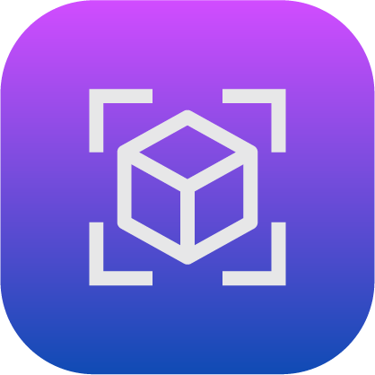

# Parameter Manager

The Parameter Manager app is where you view and modify system-wide data. Depending on what type of data you want to view, tap one of the three tabs at the top: **Global User Variables**, **Applications \(Apps\)**, or **Devices**.

-   **[Global User Variables](../ParameterManager/GlobalUserVariables.md)**  

-   **[Applications](../ParameterManager/Applications.md)**  

-   **[Devices](../ParameterManager/Devices.md)**  

