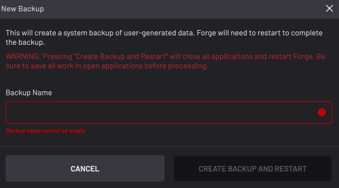
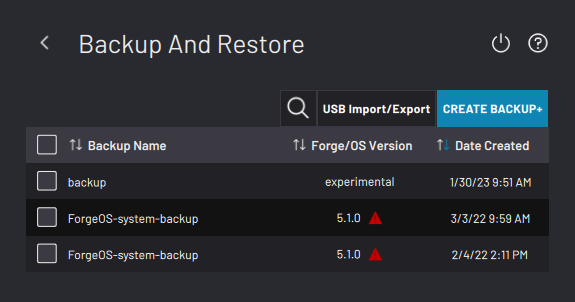
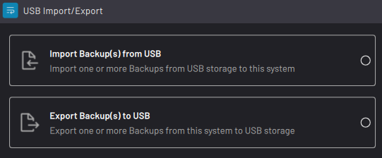
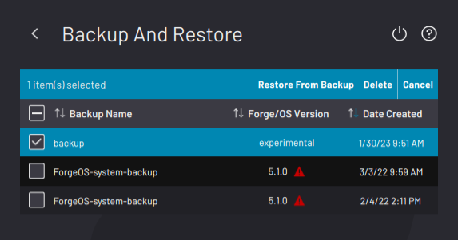
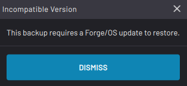

# Backup and Restore

|To take a backup of all user-generated data \(including devices, tasks, rulesets, and system settings\), tap **CREATE BACKUP+**. Enter a backup name, then tap **CREATE BACKUP AND RESTART**.**Note:** Pressing “Create Backup and Restart” will close all apps and restart ForgeOS. Save all your work in all apps before creating a backup and restarting.

||

|Backups that you create are listed in the table. Sort the table by the backup name, the ForgeOS version, or the date when you created the backup.||

|To export or import backup files to or from a USB drive, insert the USB drive into the Forge IPC. Then tap **USB Import/Export** at the top of the table.||

|To restore your system or another system on the same ForgeOS version, tap **Restore From Backup**. The restore process performs a complete system overwrite with the backed-up data. ForgeOS licenses are not included in the backup and will not be overwritten by a restore.||

|If you see a red exclamation mark next to any of the listed backups, tap it for more information about what’s wrong. You may need to update or downgrade ForgeOS to restore the selected backup.||

**Parent topic:**[Settings](../3-Settings-App/settings.md)

