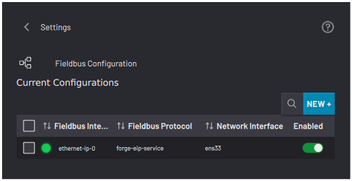
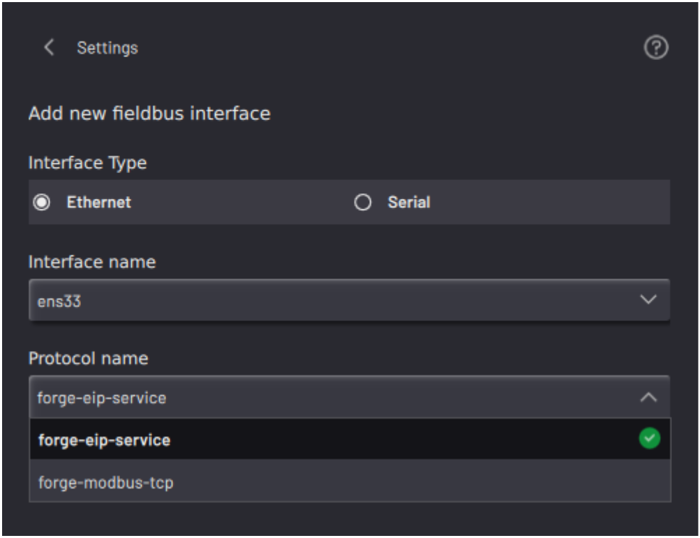
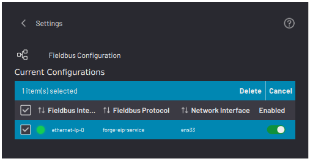

# Fieldbus Configuration

The Fieldbus Configuration screen is where you add, delete, and change the state of Fieldbus interfaces.

**Note:** Add fieldbus interfaces in the Settings app before adding remote I/O devices in the Device Configuration app.

|There is a Status Indicator to the left of each interface. The indicator is red when the interface is stopped and green when it is running.

 Tap the toggle switch in the **Enabled**column to run or stop the interface.

 Tap the blue**NEW +**button to create a new Fieldbus configuration.

||

|Choose between **Ethernet** and **Serial**, select an interface by name, and choose the protocol.

 -   For an Ethernet interface, your protocol options are Ethernet/IP and Modbus TCP.

 -   For a serial interface, ForgeOS supports Modbus RTU.

||

|Select one or more configurations and tap **Delete** to remove them from your Fieldbus configurations list.

||

**Parent topic:**[Settings](../3-Settings-App/settings.md)

