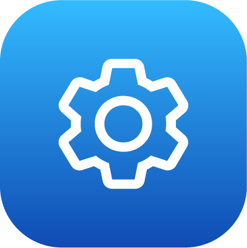
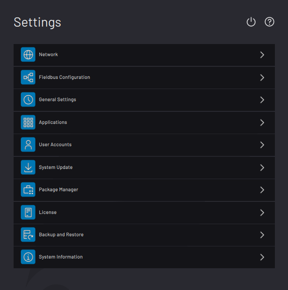

# Settings

The Settings app is used to view system information and change global settings. Sign in as **Admin**to access it.

The Settings app is organized into several menus. Tap an option to enter that menu. Return to the Settings main screen by tapping the back button at the top of the screen.

-   **[Network](../3-Settings-App/network.md)**  

-   **[Fieldbus Configuration](../3-Settings-App/fieldbus_configuration.md)**  

-   **[General Settings](../3-Settings-App/general_settings.md)**  

-   **[Applications](../3-Settings-App/applications.md)**  

-   **[User Accounts](../3-Settings-App/User_Accounts.md)**  

-   **[System Update](../3-Settings-App/system_update.md)**  

-   **[Package Manager](../3-Settings-App/Package_Manager.md)**  

-   **[License Information](../3-Settings-App/license_information.md)**  

-   **[Backup and Restore](../3-Settings-App/backup_and_restore.md)**  

-   **[System Information](../3-Settings-App/system_information.md)**  

