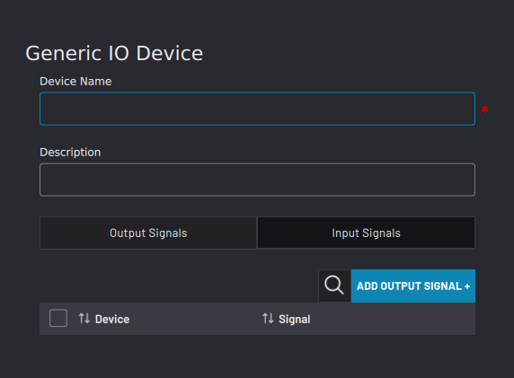
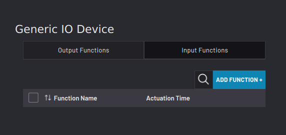
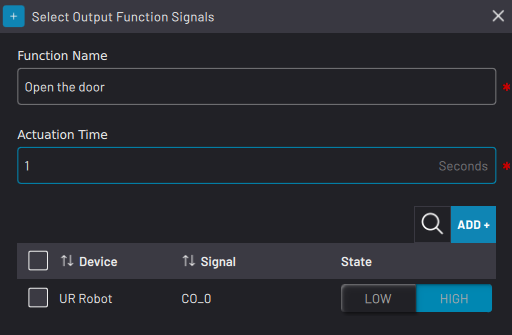
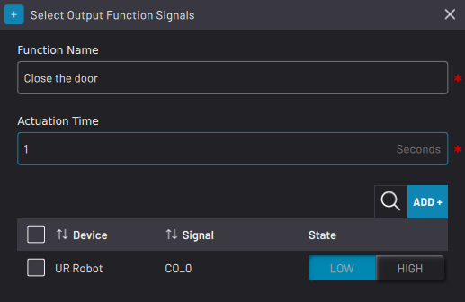
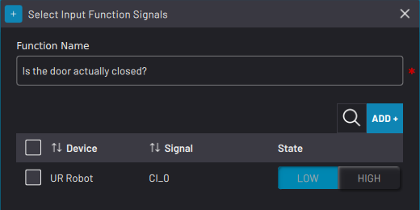
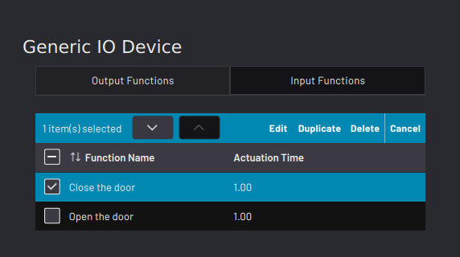

# Adding a Generic IO Device

A Generic IO Device allows you to define a custom device by creating functions that can be manually controlled through the Device Control app or programmed as blocks in Task Canvas.

1.  Select **Generic IO Device**, then tap **NEXT**.

    

2.  Type in a **Device Name**. A **Description** is optional.

    

3.  Tap the **Output Signals** and **Input Signals**tabs to link existing signals to the device. Tap **ADD OUTPUT SIGNAL+** or **ADD INPUT SIGNAL+** to open the parameter selector and select the signals. These are the signals that you will select from in the next few steps when creating the device functions. Click **NEXT** when you are finished.

    **Tip:** You can always return to this screen later to add or remove signals.

4.  Follow these substeps to add your output and input functions.

    

    1.  In the **Output Functions**tab, tap **ADD FUNCTION+** to set the LOW/HIGH conditions and actuation times of the selected boolean output signals. Select a signal and tap **Delete** to remove it from the function. Tap**ADD+** to add a signal back. The **Actuation Time** is how long Forge/OS will wait for the function to execute. Tap **SAVE** for the function to appear in the table.

        |||

    2.  In the **Input Functions**tab, tap **ADD FUNCTION+** to set the LOW/HIGH conditions of the selected boolean input signals. Select a signal and tap **Delete** to remove it from the function. Tap**ADD+** to add a signal back. Tap **SAVE** for the function to appear in the table.

        

5.  In the table of saved functions, select a function to change its order in the table, edit it, duplicate it, or delete it.

    

6.  Tap **SAVE** to return to the Device Configuration home screen. Make sure the Generic IO Device appears on the configured devices list and that it is ​**enabled**​.

    **Note:** A device is **enabled** when its switch is green and toggled to the right.

**Parent topic:**[Device Configuration](../4-Device-Configuration-App/device_configuration.md)

