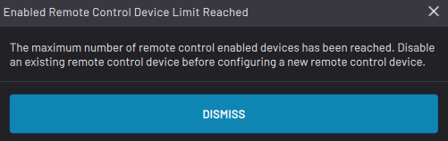
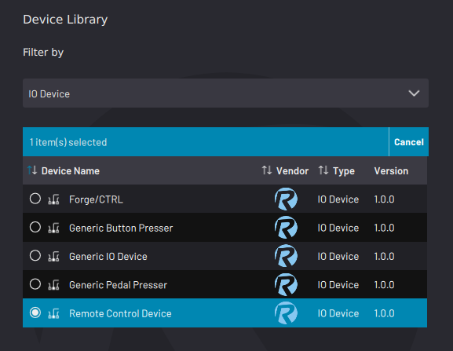
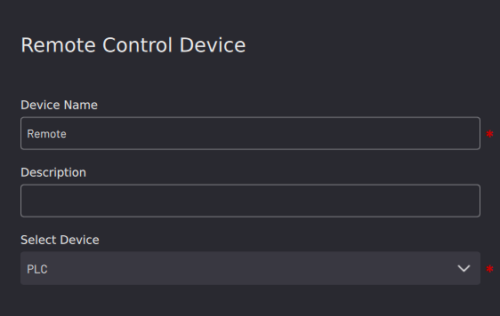
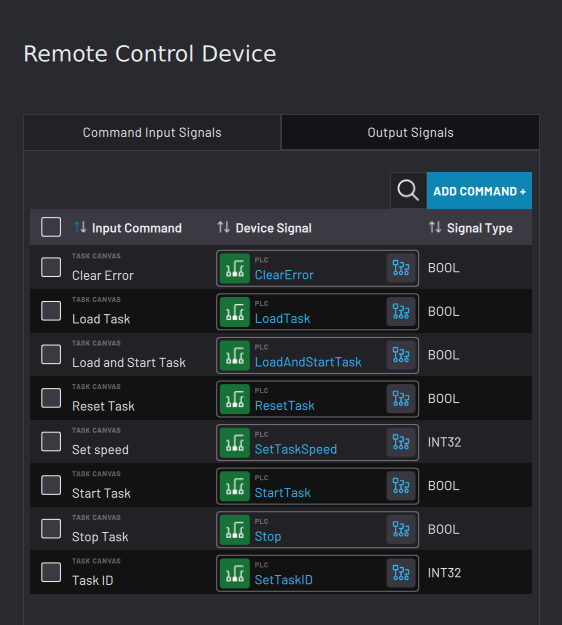
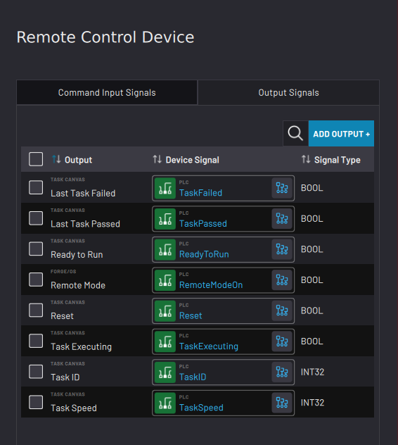

# Adding a Remote Control Device

A Remote Control Device allows you to communicate with ForgeOS from an external HMI.

You can only have one Remote Control Device enabled at a time. If you try to add another one, a pop-up reminds you to disable the existing one first.

**Note:** The Remote Control Device requires you to map signals. First configure a PLC or other relevant devices. Any device with IO is available to send and receive commands. Devices with pre-configured signal mapping \(such as the **Rockwell Automation Logix PAC**\) will have commands and outputs pre-mapped, allowing setup in just a few steps.

1.  Select **Remote Control Device**, then tap **NEXT**.

    

2.  Type in a **Device Name**. A **Description** is optional. In the **Select Device** dropdown, choose a device to use for remote control. Then tap **NEXT**.

    

3.  In the **Command Input Signals** tab, tap **ADD COMMAND +** to add an input command. To remove one or more input commands, select the checkbox\(es\) and tap **Remove**. For the input commands in the table, add device signals by tapping the variable selector to the right of the ‘Select a value” field.

    

    Input signals \(that are sent from the PLC to Task Canvas\) include:

    |Input Command|Description|
    |-------------|-----------|
    |Clear Error|Send a “Clear Error” signal to all devices \(as if pressing the Reset button on the READY pendant\). **Note:** This command is ignored if a task is executing.

|
    |Load Task|Load the current Task ID task and select the Start block.|
    |Load and Start Task|Load the associated task and immediately start it at 100% speed from the Start block.**Note:** If another task is currently open and executing, it stops the task and loads/starts the called task. If the called task is currently open and NOT executing, it starts the task.

|
    |Reset Task|Reset all block states. Place the view and block selection on the Start block of the Main Task.**Note:** This command is ignored if a task is executing.

|
    |Set Speed|Set the Task Canvas speed slider speed. This can be received when a task is open regardless of whether it is executing.**Note:** Accepted values are 1-100. Any value outside the accepted range is ignored.

|
    |Start Task|Start the loaded task from the selected block.**Note:** This command is ignored if a task is not open or if a task is executing. If a block was stopped mid-execution, it is resumed and not restarted. If there are multiple paused subtasks executing, this command assumes the “Resume Simultaneous Execution” option.

|
    |Stop Task|Perform a controlled stop on an executing task \(as if pressing the Stop button on the READY pendant\).**Note:** This command does NOT execute a reset, but rather leaves blocks in a paused state. This command is ignored if a task is not executing.

|
    |Task ID|Specify the task to be loaded on a **Load Task** or **Load and Start Task** command. A Task’s ID can be set in the Remote Task ID field in Task Settings.**Note:** A change in value does NOT immediately load the specified task, but rather just places that task “on deck” for a Load Task or Load and Start Task command.

|

4.  In the **Output Signals** tab, tap **ADD OUTPUT +**to add an output. To remove one or more outputs, select the checkbox\(es\) and tap **Remove**. For the outputs in the table, add device signals by tapping the variable selector to the right of the ‘Select a value” field.

    

    Output signals \(that are sent from Task Canvas or ForgeOS to the PLC\) include:

    |Output Command|Description|
    |--------------|-----------|
    |Last Task Failed|The last task failed upon completion. This value is reset when a task is started or resumed.|
    |Last Task Passed|The last task passed upon completion. This value is reset when a task is started or resumed.|
    |Ready to Run|A task is open. All devices needed to execute the task are in RUN or OK mode. There are no safety errors. A block is selected to Start or Resume the task.|
    |Remote Mode|The Remote Control toggle in the Taskbar's User button flyout is enabled \(green and toggled to the right\).|
    |Reset|A task is open and not executing. All blocks are at their initial states. No block has the “Last Executed” icon, and the Start block of the Main Task is selected and visible.|
    |Task Executing|A task is currently running.|
    |Task ID|This is the integer value of the current task \(as defined by the Remote Task ID field in Task Settings\). This field is 0 when no task is loaded \(even if the command “Task ID” has been set\).|
    |Task Speed|This is the current value of the Task Canvas speed slider. The range of possible values is 1-100. This field is null when a task is not open.|

5.  Tap **SAVE** to return to the Device Configuration home screen. Make sure the Remote Control Device appears on the configured devices list and that it is **enabled**.

    **Note:** The SAVE button is only available when all Device Signal fields are filled in.

    **Note:** A device is **enabled** when its switch is green and toggled to the right.

**Parent topic:**[Device Configuration](../4-Device-Configuration-App/device_configuration.md)

