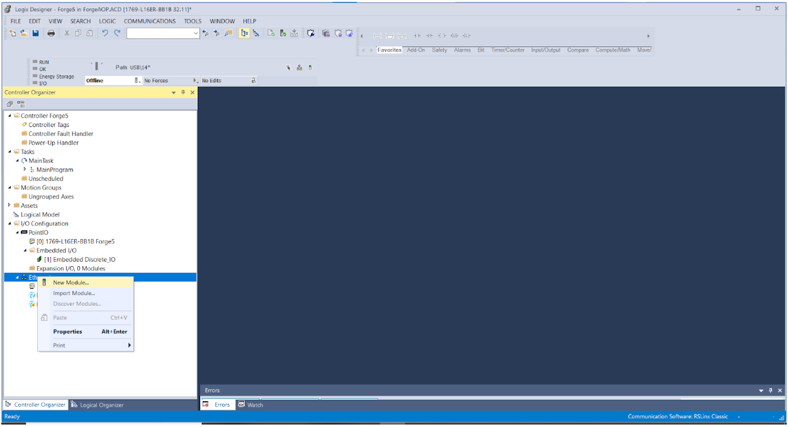
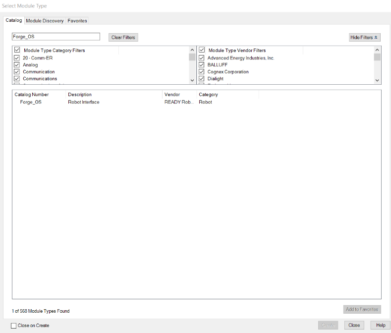
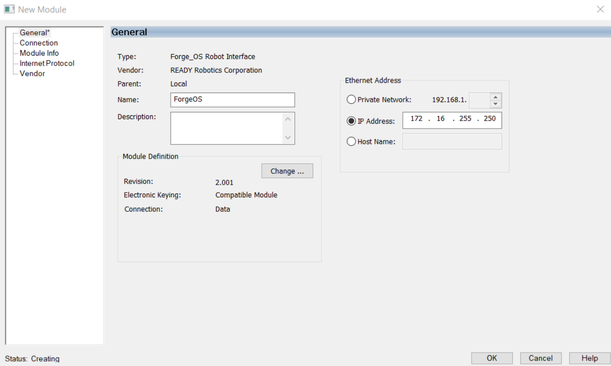
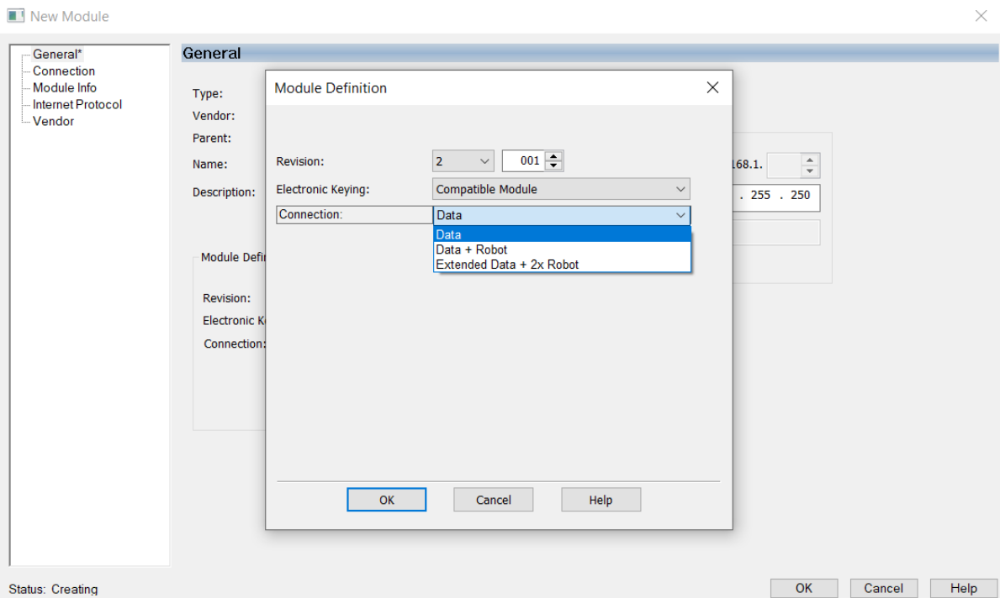
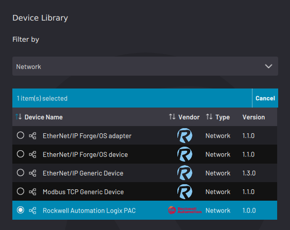
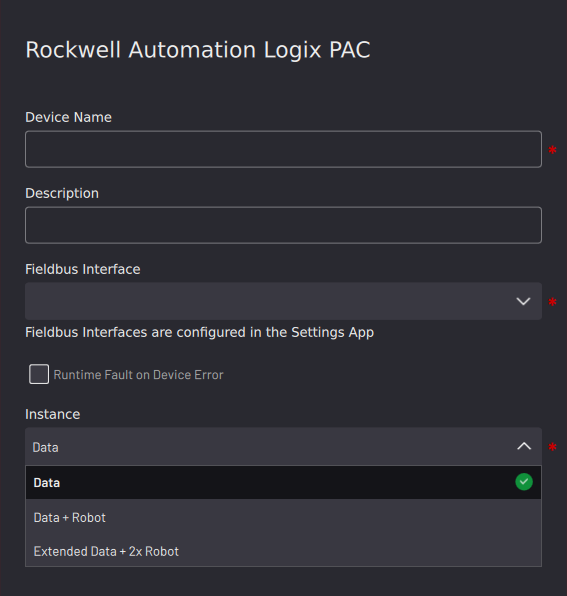
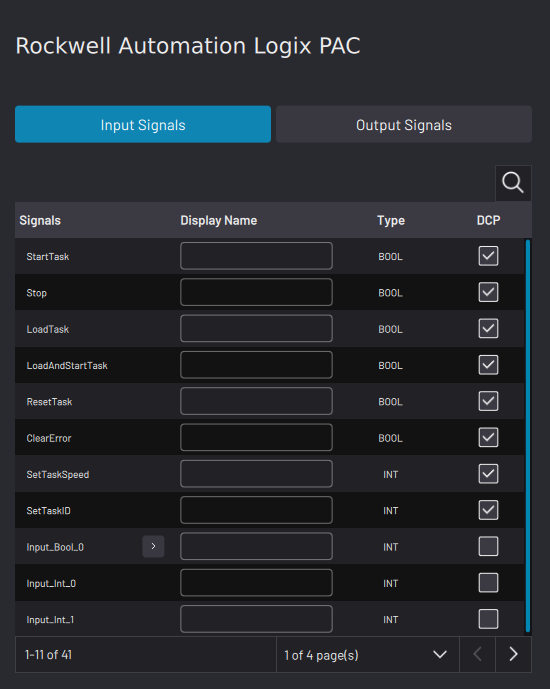

# Adding a Rockwell Automation Logix PAC

In ForgeOS versions prior to 5.3.0, Rockwell Automation Logix PACs connected to the **EtherNet/IP ForgeOS Adapter** network device. This provided a generic set of 132 bytes of input/output for you to define. Even though a usable connection was established, it required effort to map all process data and functions.

Now, the READY Robotics **AOP** \(**Add On Profile**\) streamlines this process. The AOP establishes a special Ethernet/IP Adapter connection with a defined data map, creating a deeper integration with Logix PACs than was possible with stand-alone EDS files. For an example of how pre-defined signal mapping can ease setup, see [Adding a Remote Control Device](Adding_a_Remote_Control_Device.md).

**Note:** The AOP is available for download on the READY Support site.

After you install the READY Robotics AOP in Studio 5000, follow the steps in this section to connect to Forge/OS and create a **Rockwell Automation Logix PAC** device.

**Note:** Before creating a Rockwell Automation Logix PAC device, first add an Ethernet/IP fieldbus interface in the Settings app. See [Fieldbus Configuration](../3-Settings-App/fieldbus_configuration.md) to learn more.

Once you create the device, you will be able to send and receive data to and from the Logix PAC through Check and Set blocks in Task Canvas.

1.  In Studio 5000, create a new project.

2.  Right-click the **Ethernet**menu and select **New Module**.

    

3.  Select **Forge\_OS**from the module list.

    

4.  Give the Device a **Name**. Then type in the **IP Address**that Forge/OS is running on.

    

5.  Click **Change**under the module definition to select a data model type:

    -   **Data**: Transfer integer \(INT\), unsigned integer \(UINT\), and float task data.
    -   **Data + Robot**: Do everything that the "Data" type can do, plus transfer robot data \(such as robot status, current robot position, TCP translational/ rotational velocities, and joint velocities\).
    -   **Extended Data + 2x Robot**: Do everything that the "Data + Robot" type can do, but for two sets of robot data.
    

6.  Click **OK**to save your module definition change. Click **OK**again to save the module.

7.  In the Forge/OS Device Library, select**Rockwell Automation Logix PAC** \(Network device type\). Then tap **NEXT**.

    

8.  Type in a **Device Name**. A **Description** is optional. Then follow the below substeps before tapping **NEXT**.

    1.  In the **Fieldbus Interface**dropdown, select a configured fieldbus interface.

    2.  Select \(or leave de-selected\) the checkbox labeled "**Runtime error on device disconnection**". This checkbox allows you to configure system behavior if the device disconnects. When this checkbox is active and the PAC is not connected, the device enters a “Device is Disconnected” error state. This error state stops the task if it is running or prevents a task from starting. Currently, as long as the fieldbus driver is functioning properly, the device will never go into an error state.

    3.  In the **Instance** dropdown, select the data model type that you chose in Studio 5000.

        **Note:** Depending on which data model type you choose, you may need to fill in an optional **Robot** dropdown\(s\). This dropdown includes all robot devices on the system. Selecting a robot here automatically pulls data from that device and maps it to the specified Ethernet/IP registers. The units specified in the Settings app will be used when sending this data.

        

9.  Configure any **Input/Output \(I/O\)** signals that you want to view in the Device Control app.

    1.  Tap the tabs at the top of the screen to toggle between **Input Signals**and **Output Signals**.

    2.  \(Optional\): Enter a Display Name to signify what each configured signal does.

    3.  If you want a signal to appear in the device’s Device Control page, tap the **DCP** checkbox next to that signal.

        

10. Tap **SAVE** to return to the Device Configuration home screen. Make sure the PAC appears on the configured devices list and that it is **enabled**.

**Parent topic:**[Device Configuration](../4-Device-Configuration-App/device_configuration.md)

