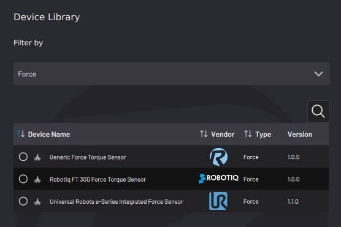
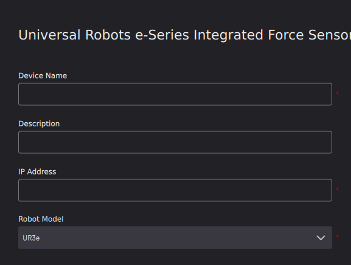
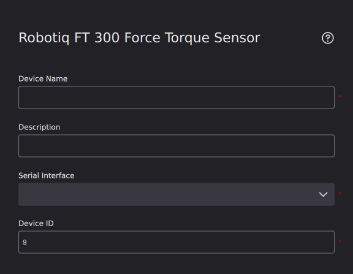
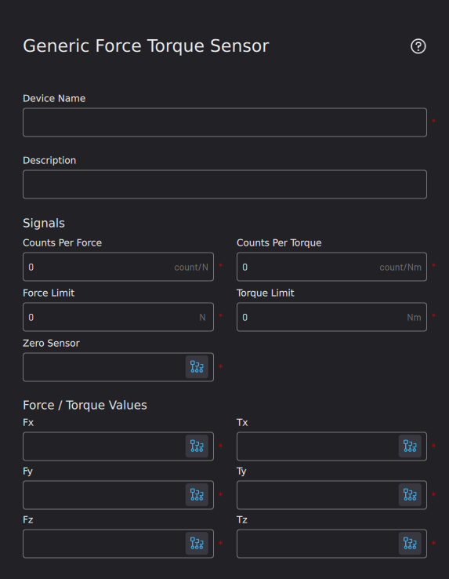
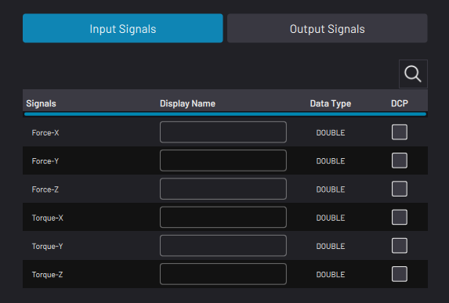

# Adding a Force Sensor

Forge‍OS 5 supports three force sensor options: **A Universal Robot e-Series Integrated Force Sensor**, a **Robotiq FT 300 Force Torque Sensor**, and a **Generic Force Torque** **Sensor**.

|**UR e-Series Integrated FT Sensor:** To add a Universal Robots e-Series Integrated Force Sensor, enter a **Device Name**, **IP Address**, and **Robot Model**. A **Description** is optional.

||

|**Robotiq FT 300 Sensor:**To add a Robotiq force torque sensor, choose the USB communication port that the sensor is connected to with a serial-USB adapter. Enter a unique **Device ID** if you are using multiple devices over the same serial interface. Leave the default Device ID value if you are using one serial device.

||

|**Generic FT Sensor:**If you are not using an e-Series UR robot or a Robotiq Force Torque sensor, add a Generic Force Torque Sensor. Enter the specifications of your sensor, including **counts per force/torque**, **force/torque limits**, and **sampling rate**. Then select the signals for zeroing the sensor and detecting force and torque in each Cartesian direction.

||

For each of these force torque sensors, select the checkbox next to the signal\(s\) that you want to see and zero in the device's Device Control page \(**DCP**\).

Tap **SAVE** to return to the Device Configuration home screen. Make sure the force sensor appears on the configured devices list and that it is ​**enabled**​.

**Note:** A device is **enabled** when its switch is green and toggled to the right.

**Parent topic:**[Device Configuration](../4-Device-Configuration-App/device_configuration.md)

