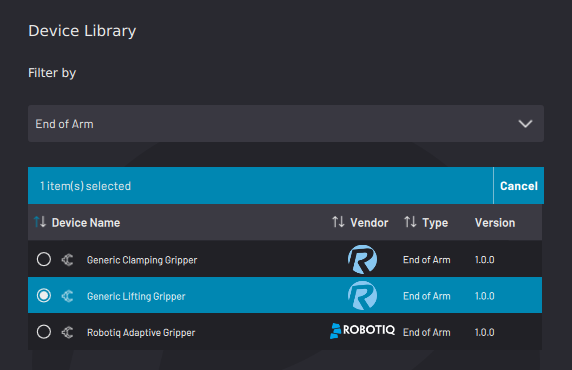
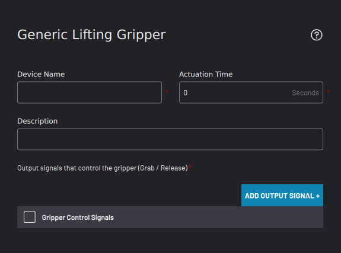
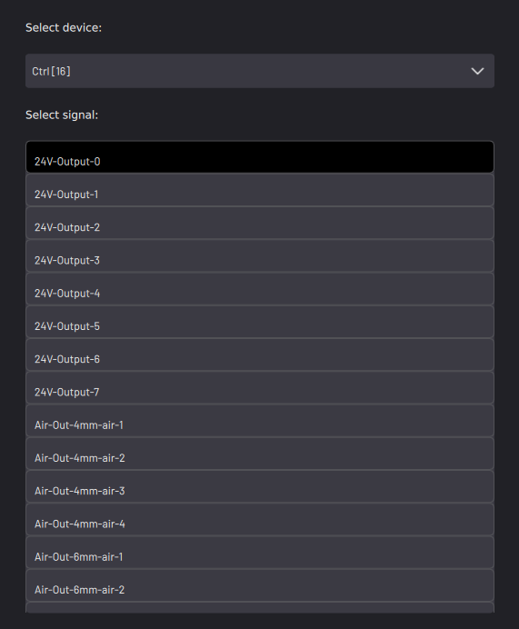
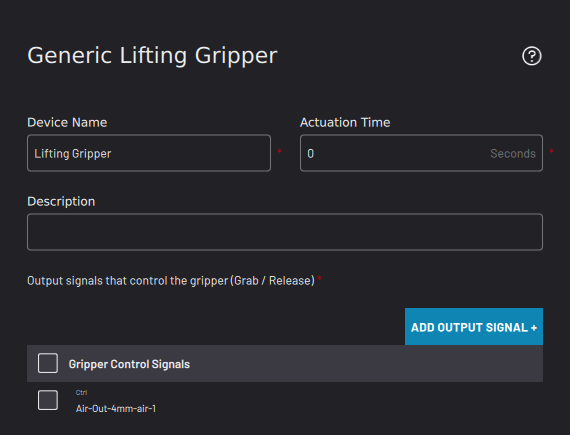
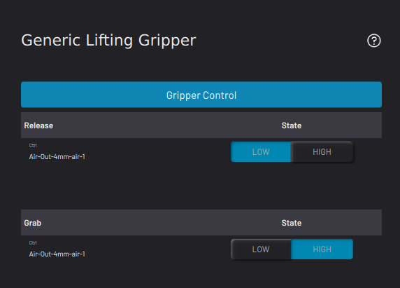
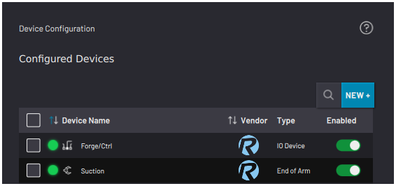

# Adding a Lifting Gripper

Follow the instructions in this section to configure a generic lifting gripper \(such as a suction gripper or magnetic gripper\).

**Note:** To use a lifting gripper without robot I/O, first configure the IPC and I/O devices. See [Fieldbus Configuration](../3-Settings-App/fieldbus_configuration.md) settings to learn more. Then select the signals for controlling air to the gripper.

1.  Select **Generic Lifting Gripper**. Then tap **NEXT**.

    

2.  Enter a **Device Name**. A **Description** is optional.

    

3.  To make sure your device has enough time to actuate on and off in a task, enter the device's estimated **Actuation Time**. The default value is zero seconds.

    **Note:** In Task Canvas, that device's control blocks prompt you to choose whether or not the task waits for the set Actuation time.

4.  Tap **ADD NEW OUTPUT SIGNAL**.

    1.  From the **Select Device** dropdown menu, select a configured I/O device driving the gripper.

        

    2.  Select the air port\(s\) or I/O signals that your gripper use. Then tap **SAVE**.

5.  Once all air ports required for the lifting device are listed in the **Gripper Control Signals** table, tap **NEXT**.

    

6.  Choose which gripper state \(Release or Grab\) corresponds to a **HIGH** or **LOW** signal.

    

    **Note:** You cannot save the gripper configuration if you select the same conditions for multiple gripper states.

7.  Tap **SAVE** to return to the Device Configuration home screen. Make sure the Lifting Gripper appears on the configured devices list and that it is ​**enabled**​.

    

    **Note:** A device is **enabled** when its switch is green and toggled to the right.

**Parent topic:**[Device Configuration](../4-Device-Configuration-App/device_configuration.md)

