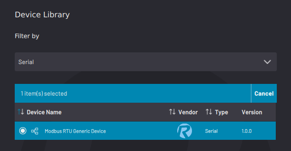

# Adding a Serial Device

**Note:** To add a Serial-based fieldbus device, such as a Modbus RTU device, first add a serial interface to ForgeOS in the Settings app. See [Fieldbus Configuration](../3-Settings-App/fieldbus_configuration.md) settings to learn more.

1.  Select a Serial device. Then tap **NEXT**.

    

2.  Type in a**Device Name**, select the**Fieldbus Interface**, and enter other required information. Refer to the device manufacturer’s guides for device setup parameters.

3.  Tap **SAVE** to return to the Device Configuration home screen. Make sure the serial device appears on the configured devices list and that it is ​**enabled**​.

    **Note:** A device is **enabled** when its switch is green and toggled to the right.

**Parent topic:**[Device Configuration](../4-Device-Configuration-App/device_configuration.md)

