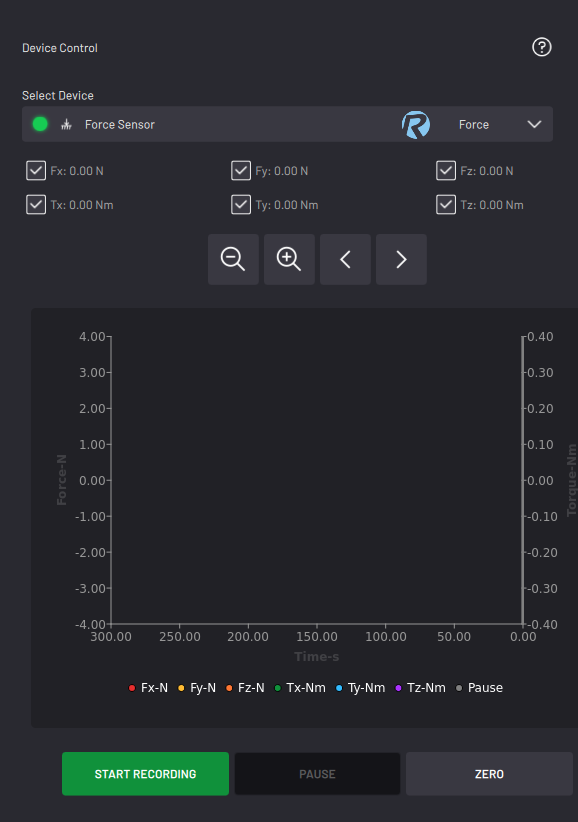

# Controlling a Force Sensor

When you select a force torque sensor, the app displays an active graph of force and torque over time.

By default, all components of force and torque \(**Fx, Fy, Fz, Tx, Ty,**and **Tz**\) are shown on the graph. Un-check any of the items that you don't want to see.

-   Tap **START RECORDING** to begin reading force and torque values.
-   Tap **PAUSE** to stop collecting force and torque values.
-   Tap **ZERO** to zero or bias the sensor.

Look through the graph's data with the navigation tools above it. You can zoom in, zoom out, or scroll left or right. The zoom controls change the scaling of the Time axis.

**Parent topic:**[Device Control](../5-Device-Controls-App/device_control_panel.md)

