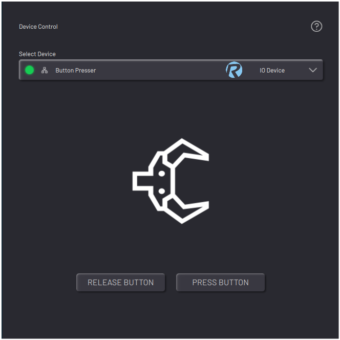

# Controlling a Button/Pedal Presser

When you select a button presser or pedal presser, the app shows controls to press or release with force. You can also relax the pedal presser \(apply no force to press or release\). The controls are set by the device's configuration.

**Parent topic:**[Device Control](../5-Device-Controls-App/device_control_panel.md)

