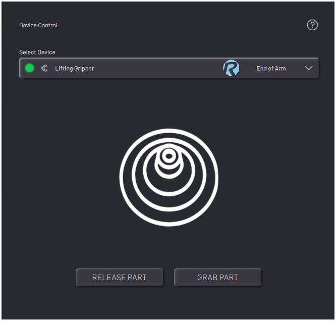

# Controlling a Lifting Gripper

When you select a lifting gripper, such as an end-of-arm vacuum suction gripper, the app shows controls to release or grab the part. For a suction gripper, these controls turn the suction off and on.

**Parent topic:**[Device Control](../5-Device-Controls-App/device_control_panel.md)

