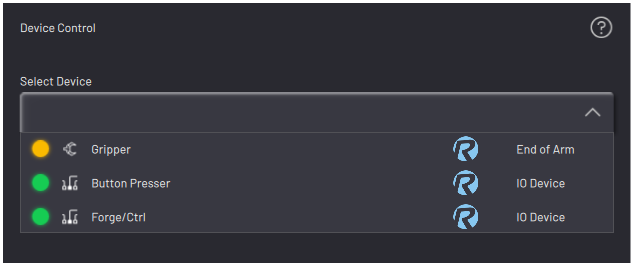

# Device Control

Use the Device Control app to manually control devices while programming a task or to recover from errors.

## Selecting a Device

Tap the Select Device dropdown and choose the device to control. Only devices added and enabled in the Device Configuration app may be controlled. The screen shows information and controls for the selected device.

Only one device at a time may be controlled in the Device Control app. For example, a robot arm cannot be moved at the same time that a gripper is actuated. Switch between the devices using the dropdown.

Switch between the Device Control app and any other app as needed. When you leave the Device Control app and return, it still displays the controls for the most recently selected device.

-   **[Controlling a Robot](../5-Device-Controls-App/controlling_a_robot.md)**  

-   **[Controlling a Lifting Gripper](../5-Device-Controls-App/controlling_a_lifting_gripper.md)**  

-   **[Controlling a Clamping Gripper](../5-Device-Controls-App/controlling_a_clamping_gripper.md)**  

-   **[Controlling a Robotiq Adaptive Gripper](../5-Device-Controls-App/controlling_a_robotiq_gripper.md)**  

-   **[Controlling a Force Sensor](../5-Device-Controls-App/controlling_a_force_sensor.md)**  

-   **[Controlling a Generic IO Device](../5-Device-Controls-App/Controlling_a_Generic_IO_Device.md)**  

-   **[Controlling a Button/Pedal Presser](../5-Device-Controls-App/controlling_a_generic_button_pedal_presser.md)**  

-   **[Controlling a Network I/O Device](../5-Device-Controls-App/controlling_a_network_device.md)**  

