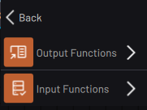

# Generic IO Device Blocks

|The Generic IO Device blocks include menus for calling that device's **Output Functions**and **Input Functions**.

||

**Parent topic:**[Block Glossary](../../6-Task-Canvas-App/Block_Glossary/block_glossary.md)

