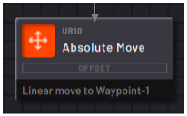

# Absolute Move Block

|The Absolute Move block performs a motion to a single position defined by a waypoint.

In the **Main**tab, tap the **Waypoint selector**to create a new waypoint or choose an existing waypoint.

Tap **Linear Move** or **Joint Move** to select the motion that the robot performs to the waypoint.

||

|-   A **Linear**move tells the robot to take the shortest path to the programmed TCP pose. Depending on where the robot is moving from, several joint positions may be possible for the same TCP pose.

-   To guarantee that the robot moves to the same joint positions every time, choose **Joint**.

||

See [Robot Command Blocks](robot_command_blocks.md) for more info on the other block features.

**Parent topic:**[Robot Command Blocks](../../6-Task-Canvas-App/Block_Glossary/robot_command_blocks.md)

