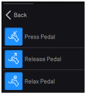
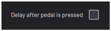

# Pedal Presser Blocks

|The Pedal Presser blocks include **Press Pedal,** **Release Pedal**, and **Relax Pedal**.

||

|Enable delay to wait for the time specified in the device configuration before the task moves on.

||

**Note:** Make sure you add the proper delay to gripper in Device Configuration and check the wait box in the gripper block. Without the added delay, the task could move on or finish before the gripper completes its action.

**Parent topic:**[Block Glossary](../../6-Task-Canvas-App/Block_Glossary/block_glossary.md)

