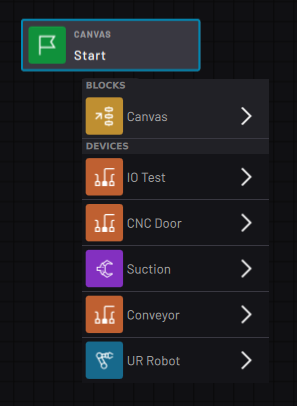

# Block Glossary

The types of **blocks**available in Task Canvas depend on the devices you added in Task Settings.

Add blocks to a task from the **Block Menu**. The Block Menu organizes block types by device, except for the Canvas blocks. **Canvas**blocks are not specific to any device. Some of them can control multiple devices and others control flowchart logic or variables.

-   **[Canvas Blocks](../../6-Task-Canvas-App/Block_Glossary/canvas_blocks.md)**  

-   **[Robot Command Blocks](../../6-Task-Canvas-App/Block_Glossary/robot_command_blocks.md)**  

-   **[Forge/Ctrl Blocks](../../6-Task-Canvas-App/Block_Glossary/forge_ctrl_blocks.md)**  

-   **[Network I/O Device Blocks](../../6-Task-Canvas-App/Block_Glossary/fieldbus_device_blocks.md)**  

-   **[Serial Device Blocks](../../6-Task-Canvas-App/Block_Glossary/serial_device_blocks.md)**  

-   **[Smart Gripper Blocks](../../6-Task-Canvas-App/Block_Glossary/smart_gripper_blocks.md)**  

-   **[Force Sensor Blocks](../../6-Task-Canvas-App/Block_Glossary/force_sensor_blocks.md)**  

-   **[Clamping Gripper Command Blocks](../../6-Task-Canvas-App/Block_Glossary/all_clamping_gripper_command_blocks.md)**  

-   **[Lifting Gripper Command Blocks](../../6-Task-Canvas-App/Block_Glossary/all_lifting_gripper_command_blocks.md)**  

-   **[Generic IO Device Blocks](../../6-Task-Canvas-App/Block_Glossary/General_IO_Device_Blocks.md)**  

-   **[Button Presser Blocks](../../6-Task-Canvas-App/Block_Glossary/all_button_presser_blocks.md)**  

-   **[Pedal Presser Blocks](../../6-Task-Canvas-App/Block_Glossary/all_pedal_presser_blocks.md)**  

**Parent topic:**[Task Canvas](../../6-Task-Canvas-App/task_canvas.md)

