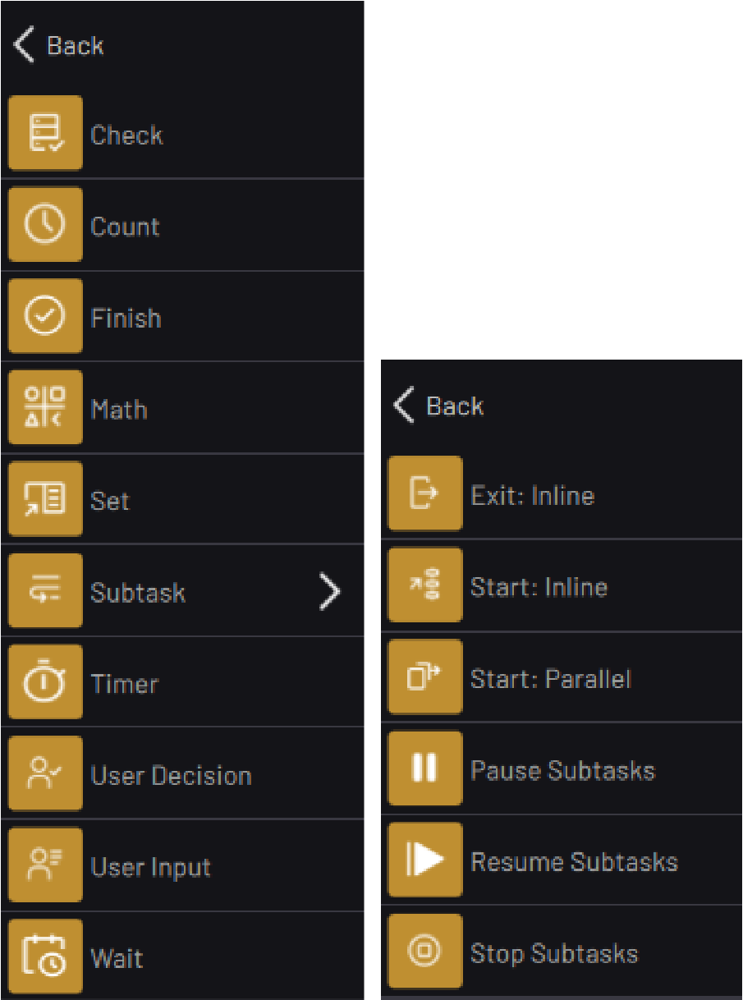

# Canvas Blocks

The Canvas blocks include Check, Count, Finish, Math, Set, Timer, User Decision, User Input, Wait, and Subtask blocks. The Subtask blocks allow for multitasking with subtasks. They include, Exit, Start, Pause, Resume, and Stop.

-   **[Check Block](../../6-Task-Canvas-App/Block_Glossary/check_block.md)**  

-   **[Count Block](../../6-Task-Canvas-App/Block_Glossary/count_block.md)**  

-   **[Finish Block](../../6-Task-Canvas-App/Block_Glossary/finish_block.md)**  

-   **[Math Block](../../6-Task-Canvas-App/Block_Glossary/math_block.md)**  

-   **[Set Block](../../6-Task-Canvas-App/Block_Glossary/set_block.md)**  

-   **[Subtask \> Exit: Inline Subtask Block](../../6-Task-Canvas-App/Block_Glossary/exit_subtask_block.md)**  

-   **[Subtask \> Start Subtask: Inline Block](../../6-Task-Canvas-App/Block_Glossary/start_subtask_inline_block.md)**  

-   **[Subtask \> Start Subtasks: Parallel Block](../../6-Task-Canvas-App/Block_Glossary/start_subtask_parallel_block.md)**  

-   **[Subtask \> Pause Subtasks Block](../../6-Task-Canvas-App/Block_Glossary/pause_subtask_block.md)**  

-   **[Subtask \> Resume Subtasks Block](../../6-Task-Canvas-App/Block_Glossary/resume_subtask_block.md)**  

-   **[Subtask \> Stop Subtasks Block](../../6-Task-Canvas-App/Block_Glossary/stop_subtask_block.md)**  

-   **[Timer Block](../../6-Task-Canvas-App/Block_Glossary/timer_block.md)**  

-   **[User Decision Block](../../6-Task-Canvas-App/Block_Glossary/user_decision_block.md)**  

-   **[User Input Block](../../6-Task-Canvas-App/Block_Glossary/user_input_block.md)**  

-   **[Wait Block](../../6-Task-Canvas-App/Block_Glossary/wait_block.md)**  

**Parent topic:**[Block Glossary](../../6-Task-Canvas-App/Block_Glossary/block_glossary.md)

