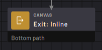
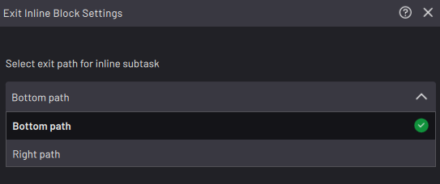

# Subtask \> Exit: Inline Subtask Block

The Exit block completes an inline subtask and exits to the canvas where the subtask was called. Without an Exit block in an inline subtask, the subtask and the calling task finish after executing the last available block.

|When an Exit block is executed, the task returns to the Start Subtask: Inline block that called the subtask and follows the chosen path \(bottom or right\).

**Note:** The Exit block is not the same as the Finish block. The Finish block stops all subtasks, including the main task. Only use the Finish block to stop all activity in your task.

||

|In the Exit block settings, choose whether the subtask exits to the Bottom or Right path of the **Start Subtask: Inline** block it returns to.

||

**Parent topic:**[Canvas Blocks](../../6-Task-Canvas-App/Block_Glossary/canvas_blocks.md)

