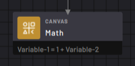
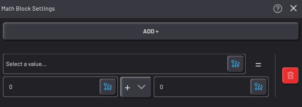
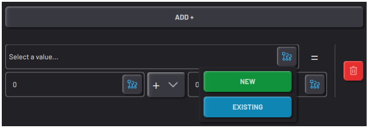
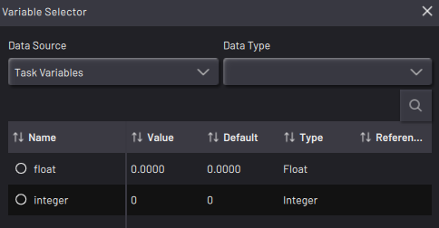
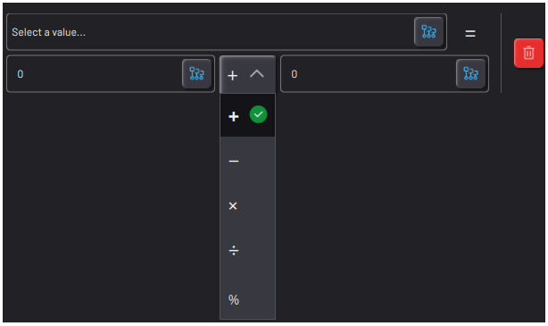

# Math Block

|The Math block executes mathematical expressions to set the values of variables.

For example, use the Math block to increment a variable as a task runs.

||

|In the Math block settings, create mathematical expressions.

||

|Tap **ADD+** to add an operation to the block.

You may add multiple operations to execute. The Math block executes each operation in order from top to bottom.

Tap the red **Delete** button to remove a line.

||

|Tap the **Selection**button in any field to select an existing variable or signal to change.

**Note:** You can choose **Float**and **Integer** variables in the Math block. You cannot choose non-numerical variables.

||

|The mathematical expressions are defined in the form:

\[Variable\] = \[\# or Variable\] \[Operator\] \[\# or Variable\].

The types of operations you can choose from are addition, subtraction, multiplication, division, and modulo \(mod\).

||

**Parent topic:**[Canvas Blocks](../../6-Task-Canvas-App/Block_Glossary/canvas_blocks.md)

