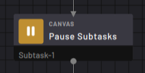
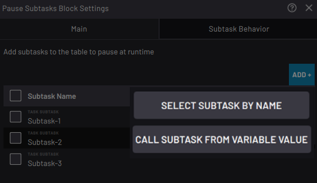
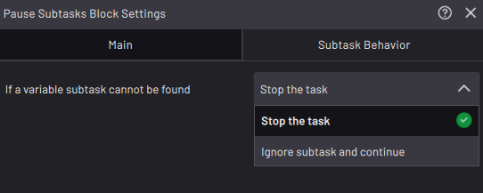

# Subtask \> Pause Subtasks Block

|The Pause Subtasks block pauses one or more subtasks until you resume them with a Resume Subtasks block.||

|In the block settings, tap **ADD +** to select one or more subtasks to pause at the block’s execution.Calling a subtask from a string or integer variable provides flexibility for having this block call whichever subtask has a name that corresponds to the current variable value. For example, if this block calls a string variable named “Variable-1” and a Set block before it sets Variable-1 to “Subtask-1”, this block will call Subtask-1.

||

|**Note:** If you are calling a subtask from a string or integer variable, select what happens when a variable subtask cannot be found. You can **Stop the task** \(to stop the task as soon as the flowchart encounters an invalid subtask\) or **Ignore subtask and continue** \(to only ignore the invalid subtasks but still execute any valid subtasks\).

||

**Parent topic:**[Canvas Blocks](../../6-Task-Canvas-App/Block_Glossary/canvas_blocks.md)

