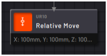
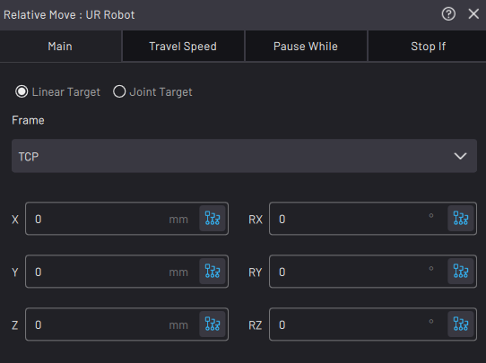

# Relative Move Block

|The Relative Move block performs a motion relative to the robot's position when the block executes. Because the motion is relative, the ending position depends on the starting position.

In the **Main**tab, tap **Linear Target** or **Joint Target**.

||

|-   Linear lets you select a Frame and program a motion along and around the Frame's axes.

-   Joint lets you program how far one or more joints rotate.

See [Robot Command Blocks](robot_command_blocks.md) for more info on the other block features.

||

**Parent topic:**[Robot Command Blocks](../../6-Task-Canvas-App/Block_Glossary/robot_command_blocks.md)

