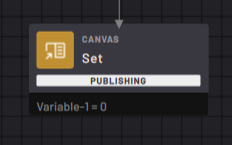
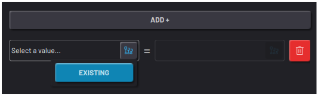
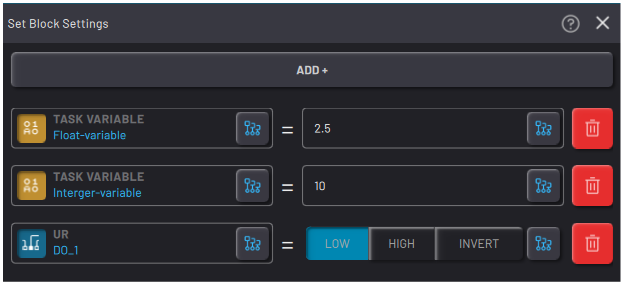
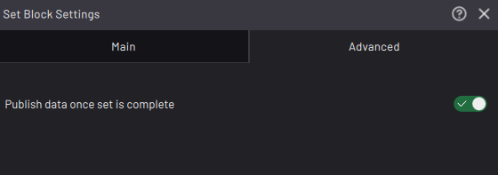

# Set Block

|The Set block sets the values or states for chosen variables and parameters.

||

|In the Set block settings, add Set expressions for the block to execute.

Tap **ADD+** to add a Set expression to the block.

Tap the **Selection**button in the left field to select an existing variable or signal.

||

|After you select a variable or signal, enter the value to set it to or tap the **Selection** button to select another variable or signal for the first one to match.

To add multiple variables and/or signals to set, tap the **ADD+** button. The Set block executes operations in order from top to bottom.

Tap the red **Delete** button to remove a line.

||

The block can set these values:

|Type of Variable or Output|Set Value|
|--------------------------|---------|
|Digital output|Low, High, Invert, variable value, or digital signal value|
|Analog output|Rational numbers, variable value, or analog signal value|
|Float variable|Rational numbers, variable value, or analog signal value|
|Integer variable|Whole numbers \(positive and negative\) or variable value|
|String variable|Alphanumeric string with special characters|
|Boolean variable|Low, High, Invert, variable value, or digital signal value|
|Waypoint/Frame|Another Waypoint/Frame \(from the same device\)|

|In the “**Advanced**” tab, enable the “**Publish data once set is complete**” to bypass synchronization delays and immediately broadcast the changed values from the block. Enabling this toggle is not necessary to guarantee that value changes are synchronized within Task Canvas.

||

**Parent topic:**[Canvas Blocks](../../6-Task-Canvas-App/Block_Glossary/canvas_blocks.md)

