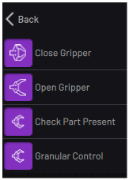
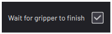
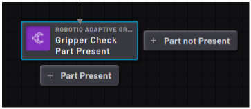
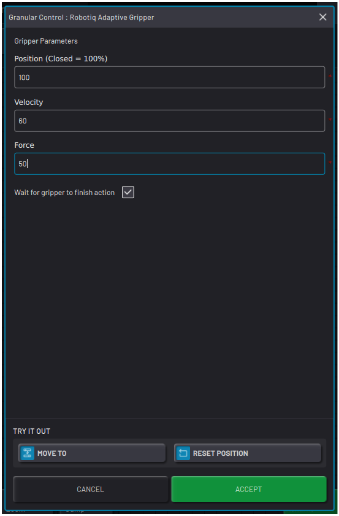

# Smart Gripper Blocks

|The Smart Gripper blocks include **Close Gripper**, **Open Gripper**, **Check Part Present**, and **Granular Control**.

||

|The **Close Gripper** block closes the smart gripper fully. The **Open Gripper** block opens the gripper fully. In each block, the **Wait for gripper to finish** checkbox adds a delay so the gripper can fully open or close before moving on.

||

**Note:** Make sure you add the proper delay to gripper in Device Configuration and check the wait box in the gripper block. Without the added delay, the task could move on or finish before the gripper completes its action.

|The **Check Part Present**block acts as a Check block, but you don't have to edit any parameters. It checks the force exerted by the gripper to see if it is holding a part.

-   If a part is present, the task continues on the bottom path.

-   If a part is not present, the task continues on the right path.

||

|The **Granular Control**block sets the gripper to a specified position with your chosen velocity and force. To create a Granular Control block, enter a number between 0-100 \(%\) in the **Position** field. Then enter numbers between 0-100 \(%\) in the **Velocity**and **Force**fields.

Select the **Wait for gripper to finish action** checkbox to make sure the task doesn't move on until after the gripper moves to the position you chose.

Use the **TRY IT OUT** section to preview the action. Tap **MOVE TO**to move the gripper to the chosen position. Tap **RESET POSITION**to move the gripper to the position it was in when you opened the block.

||

**Parent topic:**[Block Glossary](../../6-Task-Canvas-App/Block_Glossary/block_glossary.md)

