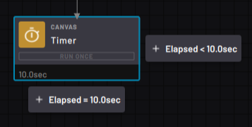
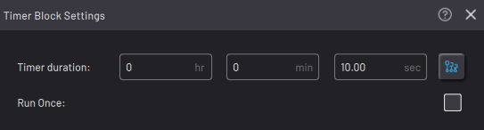
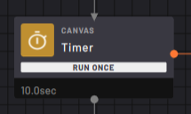

# Timer Block

The Timer block starts a timer that counts down while the task moves on.

|The timer begins when the Timer block is executed, and it continues until the time reaches zero.

When the block is executed again, the path taken depends on the timer value.

The task follows the right **Elapsed <** path while the timer is running. When the timer reaches zero, the task follows the bottom **Elapsed =** path.

||

By default, the countdown resets to the defined length of time after it reaches zero. The next time you execute the Timer, it starts the countdown over.

|In the Timer Block settings, choose the **Timer duration**. Leave the Run Once checkbox checked or unchecked.

||

|When the **Run Once** checkbox is checked, the Timer countdown runs only the first time you execute the block. Then next time the block is executed, the task follows the bottom path.

||

To create a loop of blocks that executes while the timer is running, set the looped blocks on the Timer block's **Elapsed <** path. Then connect the end of the loop back to the Timer block. A Timer block must have a right path. If there is no right path, the task ends as soon as the timer starts.

**Parent topic:**[Canvas Blocks](../../6-Task-Canvas-App/Block_Glossary/canvas_blocks.md)

