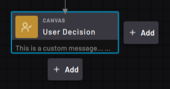
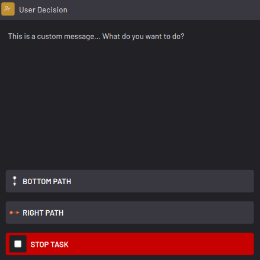

# User Decision Block

The User Decision block pauses execution until you instruct the task to resume or stop.

|When executed, the User Decision block displays custom text and prompts you to choose which path to follow \(the bottom path or the right path\).

||

|When the block is executed, a pop-up pauses execution and prompts you with the custom message and path choices. Tap one of the buttons to do that action.

||

|In the User Decision block settings, you enter a message and path button texts.

Add text to the **User decision message**box to display when the block executes at runtime.

By default, the buttons are labeled **BOTTOM PATH**, **RIGHT PATH**, and **STOP TASK**. Tap the Bottom Path and Right Path text boxes to customize the runtime button text.

||

**Parent topic:**[Canvas Blocks](../../6-Task-Canvas-App/Block_Glossary/canvas_blocks.md)

