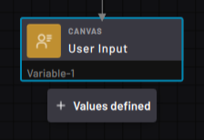
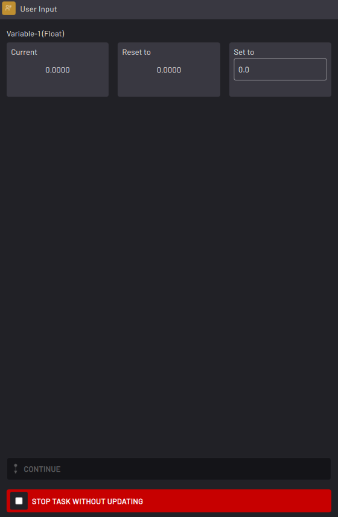
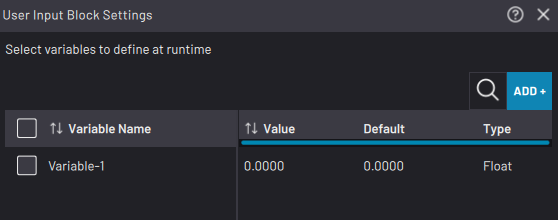

# User Input Block

|The User Input block pauses execution and prompts you to choose the values of task variables before moving on.

||

|**Note:** You can choose **Float, Integer,**and **String** variables in the User Input block. You cannot choose a **Boolean**variable.

When the User Input block is executed, a pop-up prompts you to provide a value for each selected variable.

For each listed variable, choose to keep its **Current** value, **Reset**it to its default value, or **Set** it to another value. Or tap **STOP TASK**.

||

|In the User Input block settings, add variables for you to set when the block is executed.

To add a variable to the table, click **ADD +**and select it from the Variable Selector.

||

**Parent topic:**[Canvas Blocks](../../6-Task-Canvas-App/Block_Glossary/canvas_blocks.md)

