# Block Programming

## Add Blocks

To add a block, tap an existing block and then **+ Add**. This reveals the **Block Menu.** Task Canvas organizes the block menu by the devices that a block can control.

|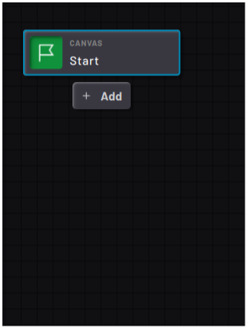|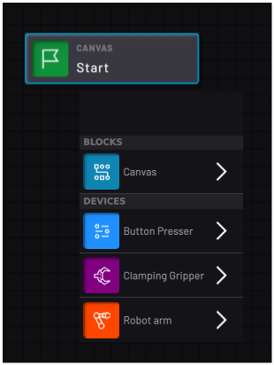|

Tap any block on the canvas to display the available paths. When you create a new task, tap the Start block to add your first block.

Blocks in the **Canvas**category are not specific to any device. Some of them can control multiple devices and others control flowchart logic or variables.

Add blocks through the bottom or right paths of existing blocks. You can add blocks on the path between existing blocks. Task Canvas inserts the new block and connects all the blocks.

## Edit Blocks

|To edit a block, tap the block to select it and tap the **Edit Block** icon in the Block Editor Menu.

|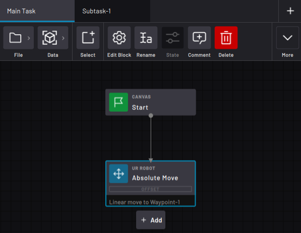|

|In the pop-up, modify the block's settings and parameters.

For example, in the Absolute Move block, change the waypoint, speed, and offset parameters.

In robot move blocks, use the **TRY IT OUT** section to preview the move. Tap **STEP BLOCK** to move the robot to the set position. Drag the **Speed** slider to determine how fast the robot moves. Tap **RESET POSITION** to move the robot to the position it was in when you opened the block.

 Tap **CANCEL**to close the block without saving the changes or **ACCEPT**to close the block and save the changes.

|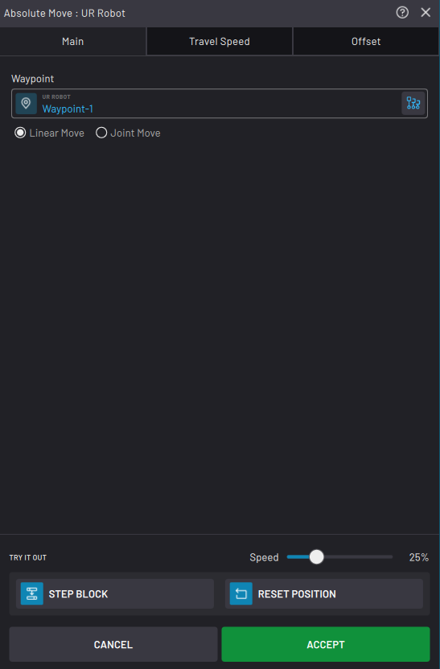|

## Rename Blocks

Naming blocks can be useful to identify the function that a block performs. For example, rename a Set block to "Turn on machine" or a Continuous Move block to "Motion exiting machine".

|To rename a block, tap the block to select it and tap the **Rename**icon on the Block Editor Menu.

Type in the name and tap the green check mark to confirm.

|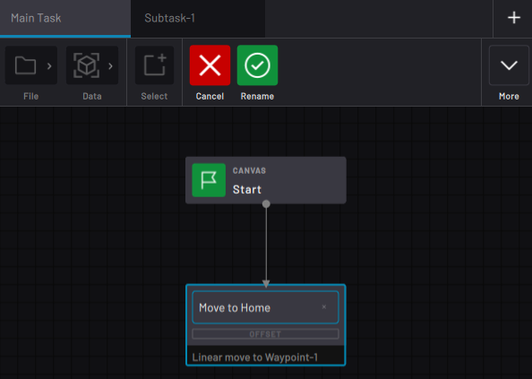|

## Cut/Copy and Paste Blocks

Move or duplicate a block using the **Cut/Paste** and **Copy/Paste**features in the expanded Block Editor Menu. Cut and Copy do not affect the parameters or custom text used by a block. You can cut or copy only one selected block at a time.

|Select the block on the canvas you want to move or duplicate, then tap **Cut**or **Copy**. Select the target block after which you want to place the cut or copied block, then select the path on which to place the block.

 Finish by tapping **Paste**on the top bar.

 **Note:** Cut removes the block from its previous location when pasting it to the new one. This may break existing paths at the previous location in a way that requires you to reconnect them.

|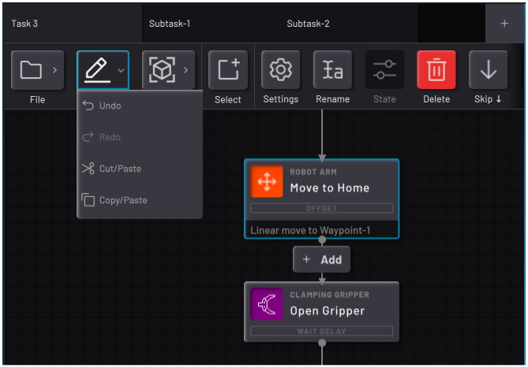|

## Delete Blocks

To remove a block from the Canvas, tap the block to select it and tap the **Delete**icon on the Block Editor Menu.

|Task Canvas reconnects paths that were going to and from that block. The app notifies you if you need to manually reconnect some paths.

 **Note:** Deleting a block from the canvas does not delete the parameters used in the block, such as waypoints or variables. To delete task parameters, use the correct data manager in the Data Menu.

||

## Add Comments to Blocks

Add comments to blocks to keep track of what each block does.

|Tap a block to select, then tap **Comment**.

 In the pop-up, type in a Title and choose a comment color \(yellow, red, or blue\). In the Comment box, type additional details. Tap **ACCEPT** to save.

 To edit or delete the comment, select the block and tap Comment again. Make changes and **ACCEPT**, or tap **DELETE COMMENT**.

|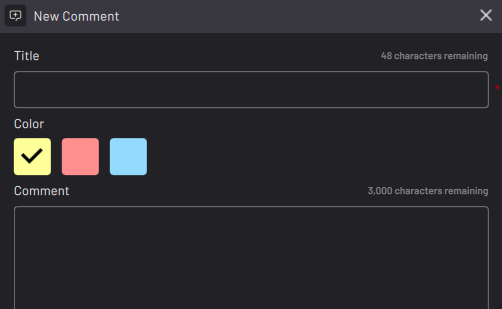|

|To view a comment, tap the colored icon at the top-right corner of the block. Tap **BACK TO BLOCK** to center the screen on the commented block. Tap**X** to close the comment.

|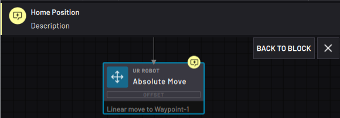|

## Add Block Notifications

Blocks can publish a notification when it either starts or finishes.

|Tap a block to select, then tap **Notify**.

 In the Title field, type in a name. This is the name that will display in the Notifications Panel table. By default, this field fills in with the name of the block.

 Choose one of four notification types. The corresponding color and symbol will appear as an icon on the block and in the “Type” column in the Notification Panel.

 -   Blue: Info

-   Green: OK

-   Yellow: Warning

-   Red: Error

|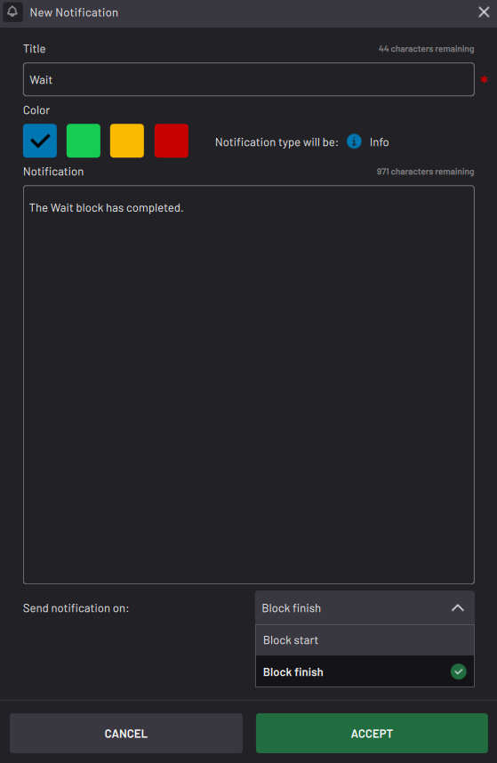|

|In the Notification box, type additional details. This info will display in a pop-up when viewing the notification.

 Finally, choose whether the notification is sent when the block starts or finishes executing.

 To edit or delete the notification settings, select the block and tap **Notify** again. Make the changes and **ACCEPT**, or tap **DELETE NOTIFICATION**.

 **Tip:** You can add this notification feature to multiple blocks at once in Select mode. When doing this, blocks will give default info notifications.

|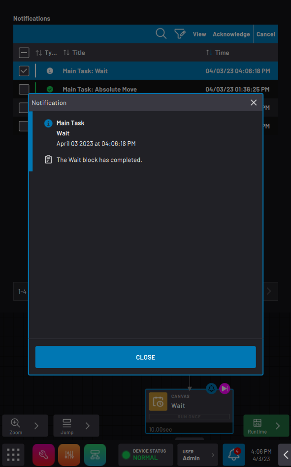|

## Change Block Execution State

Some blocks take on different states while the task is running. These states are called **Execution States**.

|For example, the execution state of a Count block that has counted to 4 is "4".

The execution state of a 30 second Wait block that is stopped at 20 seconds is "20 seconds".

When you **Resume** or **Step**, these blocks continue from where they left off. Press **Reset States** or **Reset All to Start** to quickly return them to their starting values.

|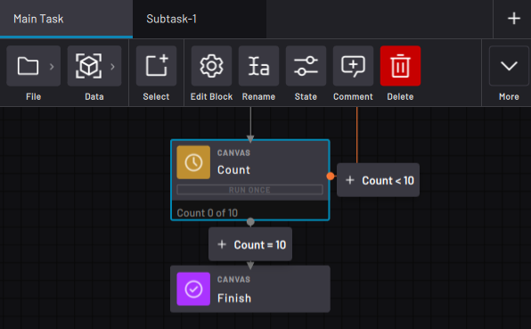|

**Note:** A *Count block* with the execution state "Count 4" resumes by counting to "Count 5". A *Grid block* with an execution state "Move to 14" resumes by moving to the 14th position in the grid. A *Wait block* with an execution state of 20 seconds resumes by counting down from 20 seconds.

|To set the execution state of a block, select the block and tap **State**. In the pop-up, type in the state and tap **UPDATE**.

|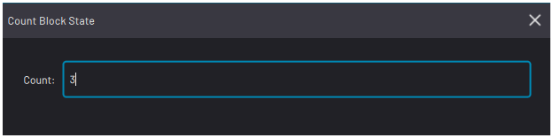|

## Skip Blocks

A "skipped" block means that it doesn't execute at runtime.

|Select a block and choose **Skip Down**or **Skip Right** to skip the block and instruct Task Canvas which path to follow instead.

Choose **Unskip** on a skipped block to restore it to execution.

**Important:** Be careful not to skip a function necessary for later actions to execute. For example, don't skip a block that opens a machine door before the robot moves into the machine.

|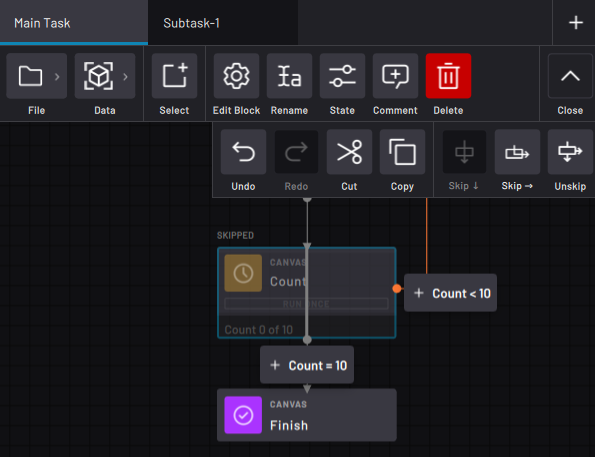|

## Select Multiple Blocks

To select multiple blocks, toggle the multi-select mode. Tap the **Select**icon on the Block Editor Menu to toggle it on \(blue\). Tap Select again to toggle multi-select off \(gray\).

|While the multi-select mode is on, select one or multiple blocks by tapping them. Task Canvas highlights selected blocks with a blue outline.

To deselect a block, tap it again.

**Note:** You cannot access block settings, rename blocks, or change block states in the multi-select mode. You can only Delete, Skip, or Unskip selected blocks in the multi-select mode.

|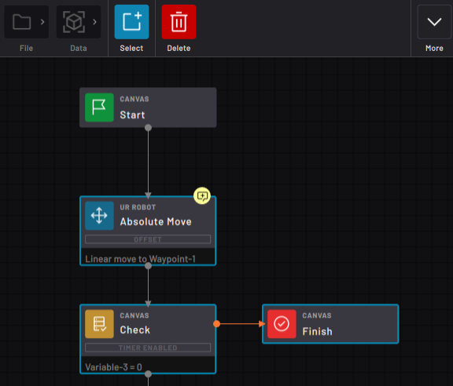|

## Connect Blocks

To create a path between existing blocks, select an exit path of the first block. Then tap **Connect To** from the Block Menu.

Select the second block where path goes, then tap **Connect** on the top menu.

|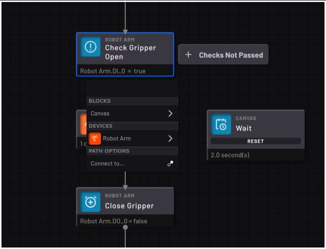|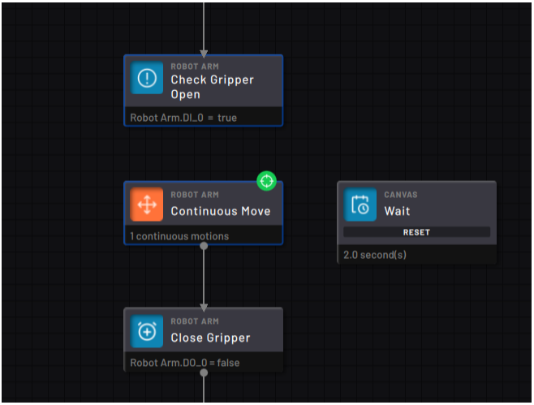|

## Detach Blocks

To remove a path between two existing blocks, select the exit path from the first block. Then select **Detach**from the Block Menu.

**Note:** Detached blocks do not execute with the task. Be sure to reconnect the blocks where you want them before executing the task.

||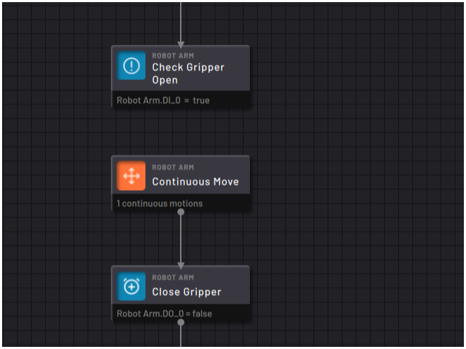

|

## Undo/Redo

Use the Undo and Redo buttons in the expanded Block Editor Menu to undo or restore actions like creating a block, deleting a block, or modifying paths.

|Tap **Undo** to undo an action in the Canvas. Tap **Redo** to redo an action that was previously undone.

 **Note:** A maximum of 32 modifications are saved in the Undo stack.

|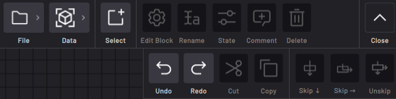|

**Parent topic:**[Task Canvas](../6-Task-Canvas-App/task_canvas.md)

