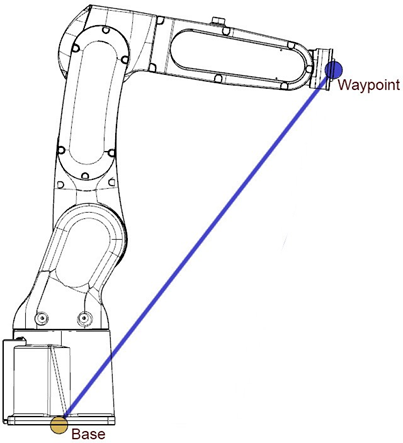
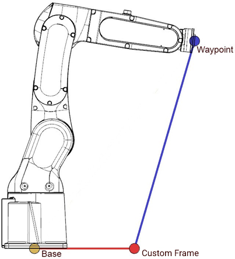
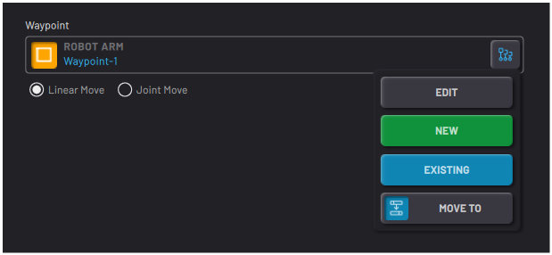
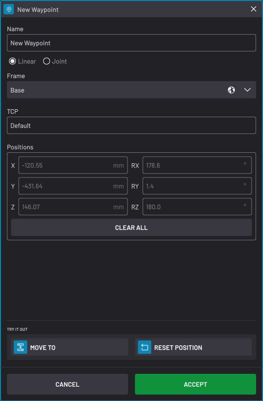
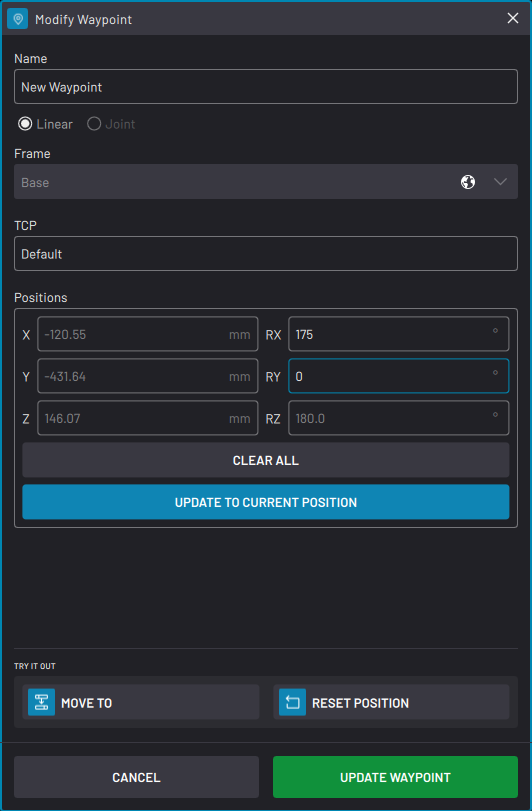
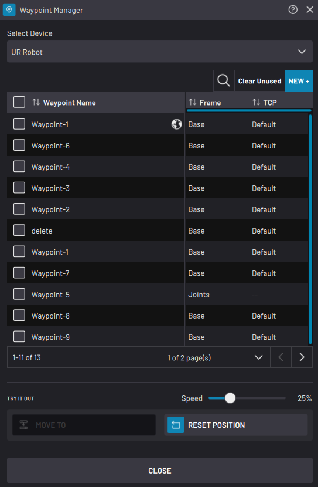
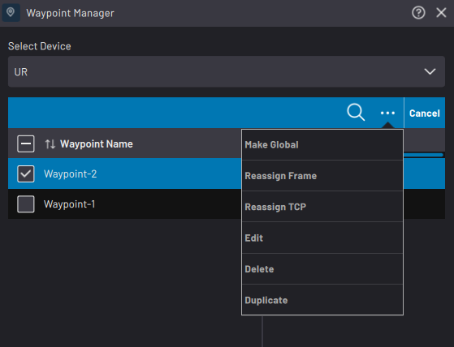
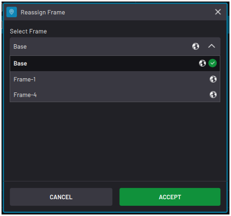
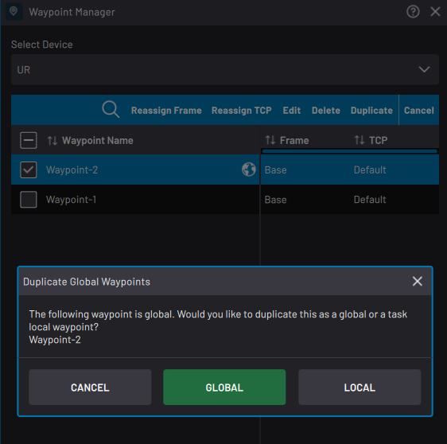

# Create and Manage Waypoints

A **Waypoint**defines the **pose**\(position and orientation\) of the robot relative to the origin of a **Frame**. Define waypoints using the **Base Frame**\(at the base of the robot\) or a **custom Frame**.

|||
|Waypoint defined by the Base Frame|Waypoint defined by a Custom Frame|

|Tap **NEW**in any robot command block waypoint field to create a waypoint.

In the New Waypoint pop-up, choose how to define the waypoint \(**Linear**or **Joint**\).

||

| |Linear Waypoint|Joint Waypoint|
|--|---------------|--------------|
|What type of data does it save?|The robot saves the pose and orientation of the Active **TCP** with respect to the chosen **Frame**. If you choose a custom Frame and that Frame moves, the waypoint moves based on the new Frame origin.**Important:** If the Active TCP is different from the one used to create a waypoint, the end effector may not move to the expected position.

|The robot saves the positions of each of its joints. It does not reference any Frame or TCP.|
|When should you choose this type of waypoint?|When you need the robot to travel the shortest, straight-line path to the waypoint. Depending on where the robot is moving from, several joint positions may be possible for the same TCP pose.|When a straight-line travel to the waypoint would cause the robot to collide with itself. Or when you need to go to the same joint positions every time \(i.e., to avoid tangling cables\).|

When creating a new waypoint, the **Positions** fields fill in with the robot's current position. Move the robot to the position you want to save or enter your own values in the Positions fields. For each field you don't type a value, the field tracks the current position of the robot until you save the waypoint.

To save the waypoint, tap **ACCEPT**.

|||

After you save a waypoint, tap the **EDIT**button to make changes to it. There are two ways that you can edit a waypoint:

1.  In the **Positions** fields, type in new values. Then tap **UPDATE WAYPOINT** to save.

    **Note:** Do not tap **UPDATE TO CURRENT POSITION**. That button changes the Positions fields to the current robot position.

2.  Move the robot in the Device Control app. Overwrite the old position values by tapping **UPDATE TO CURRENT POSITION**. Then tap **UPDATE WAYPOINT** to save.

In the New Waypoint or Modify Waypoint windows, tap **CLEAR ALL** to erase your input in all Positions fields. The fields then track the current position of the robot until you save the waypoint.

## Waypoint Manager

Use the **Waypoint Manager** to create and manage Waypoints in Task Canvas. The Waypoint Manager lists saved waypoints for the selected robot device in the open task. A waypoint created with one robot can't be used for a different robot.

|Listed for each waypoint is the **Waypoint Name**, the **Frame**, and the **Active TCP** at the time you saved the waypoint.

 To find waypoints, use the search button, sort them by name, or navigate using the page navigation buttons.

 To remove all unused waypoints from the task, select none of the waypoints and tap **Clear Unused**. A prompt lists all the unused local variables and asks you to confirm before deleting them. **Unused** waypoints are not referenced by any blocks on the canvas.

 To create a new waypoint, tap the **NEW +** button at the top of the table.

At the bottom of the manager, use the **TRY IT OUT** section to preview a selected waypoint. Tap**MOVE TO** to move the TCP to the waypoint. Drag the **Speed** slider to determine how fast the robot moves. Tap **RESET POSITION** to move the robot to the position it was in when you opened the Waypoint Manager.

||

|To make waypoints global, select them on the table and tap **Make Global**. Global waypoints are accessible to other tasks and apps. If you change a global waypoint, it changes everywhere it is used. Global waypoints have a globe icon next to them in the table.

 **Important:** Once you make a waypoint global, you cannot make it local again. However, you can create a local duplicate of a global waypoint.

||

|To reassign the Frame and TCP for selected waypoints, tap **Reassign Frame**or **Reassign TCP**. A dropdown appears to let you choose the new frame or TCP.Re-assigning the TCP or Frame for a waypoint does NOT change the position of the waypoint. For example:

-   If you change Waypoint-2's defining Frame to Frame-1 instead of Base, Waypoint-2's position won't change. Waypoint-2's position will change if you modify the coordinates of Frame-1.
-   If some waypoints use a 100mm long tool, but you want to switch to a 300mm long tool, add a new TCP for that tool. Then use Set TCP to reassign the TCP for each waypoint.

||

**Important:** You may set the Active TCP in the Device Control app or with a Set TCP/Payload block in Task Canvas. If the Active TCP is different from the TCP used to create a waypoint, the end effector may not move to the expected position.

|To edit a waypoint \(change its name or position\), select it on the table and tap **Edit**. You can only edit one waypoint at a time.

 To remove one or more waypoints from the task, select them on the table and tap **Delete**.

 To make a copy of one or more waypoints, select them on the table and tap **Duplicate**. If you are duplicating a global waypoint, choose if you want the copy to be local or global. The copy’s name will end with “-copy” to avoid name collision.

||

**Parent topic:**[Data Management](../6-Task-Canvas-App/data_management.md)

