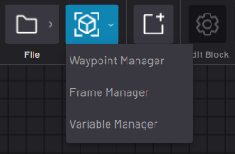

# Data Management

The Canvas Data menu is where you modify data used by blocks in the task, including robot positioning data and variables.

-   **[Create and Manage Waypoints](../6-Task-Canvas-App/create_and_manage_waypoints.md)**  

-   **[Create and Manage Frames](../6-Task-Canvas-App/create_and_manage_frames.md)**  

-   **[Create and Manage Variables](../6-Task-Canvas-App/create_and_manage_variables.md)**  

**Parent topic:**[Task Canvas](../6-Task-Canvas-App/task_canvas.md)

