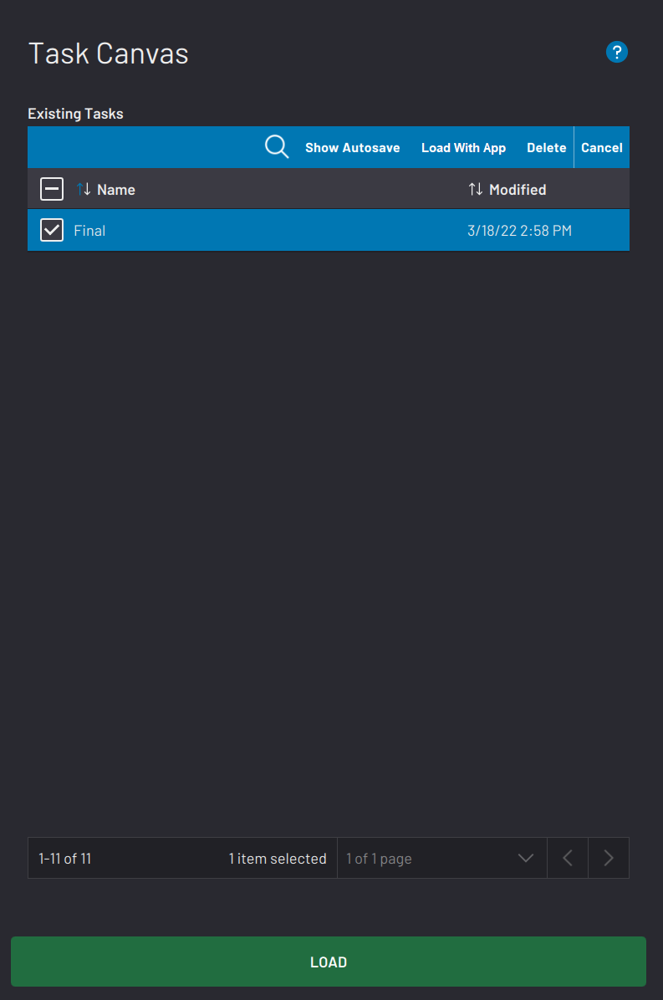
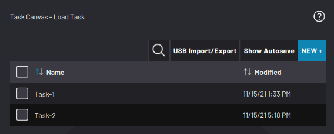
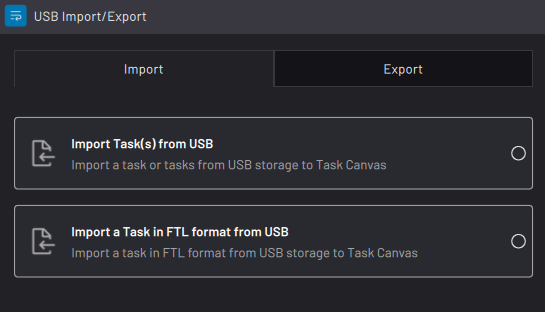

# Load Task

Load a task from the Task Canvas main screen or from the File Menu.

**Note:** If you do not want operators to have the ability to choose which task to load, you can instead use the **Load with App** feature. This feature loads a task when Task Canvas launches.

|The Load Task screen displays the list of saved tasks. Select a task in the table and tap **LOAD**to open it.

 View an automatic backup of the selected task by tapping **Show Autosave**at the top of the table. If you load an autosave file and tap **Save**from the File Menu, it saves over the main file for that task.

**Note:** Every task has an autosave version that updates after every change. If you lose power to your system without saving your task, the autosave version contains the most recent changes.

 Remove the selected task by tapping **Delete**at the top of the table.

 **Important:** Deleting a task cannot be undone. The only way to recover a deleted task is to load the autosave within 14 days and save it as a new file.

||

|To import or export a task, use a USB flash drive that has at least 1 GB of storage and is formatted to FAT32, NTFS, or ext4.

Tap **USB Import/Export**at the top of the table.

||

|Choose if you want to import or export a task.Then tap **NEXT**.

||

-   **[Importing Tasks](../6-Task-Canvas-App/usb_import_tasks.md)**  

-   **[Exporting Tasks](../6-Task-Canvas-App/usb_export_tasks.md)**  

**Parent topic:**[Task Management](../6-Task-Canvas-App/task_management.md)

