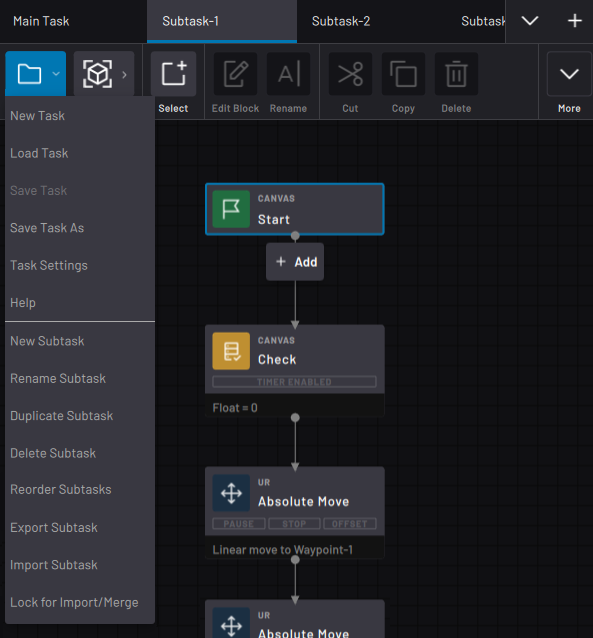

# Task Management

On the left side of the Canvas Menu is the **File menu**. The File menu lets you create or load a task, save the task, open task settings, access Help, and manage subtasks.

-   **[New Task](../6-Task-Canvas-App/new_task.md)**  

-   **[Load Task](../6-Task-Canvas-App/load_task.md)**  

-   **[Save Task](../6-Task-Canvas-App/save_task.md)**  

-   **[Task Settings](../6-Task-Canvas-App/task_settings.md)**  

**Parent topic:**[Task Canvas](../6-Task-Canvas-App/task_canvas.md)

