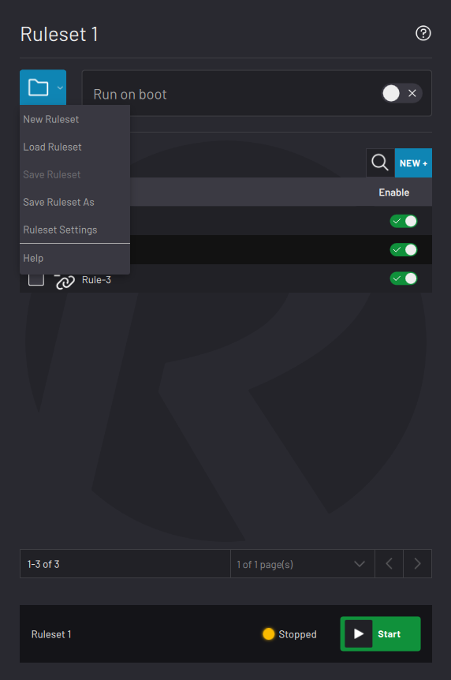

# Ruleset Management

|Inside a ruleset's manager, there is a **File menu** on the left side. The File menu lets you create or load a ruleset, save the ruleset, open ruleset settings, and access Help.

Enable the **Run on boot**toggle switch to automatically start the ruleset when ForgeOS launches.

In the table, manage the ruleset's rules. See [Rule Management](Rule_Management.md).

At the bottom of the screen, tap **Start** to begin running the ruleset's rules. Tap **Stop** to stop running the ruleset's rules.

|

|

-   **[New Ruleset](../Rule-Manager/New_Process.md)**  

-   **[Load Ruleset](../Rule-Manager/Load_Process.md)**  

-   **[Save Ruleset](../Rule-Manager/Save_Process.md)**  

-   **[Ruleset Settings](../Rule-Manager/Process_Settings.md)**  

**Parent topic:**[Rule Engine](../Rule-Manager/Rule_Manager.md)

