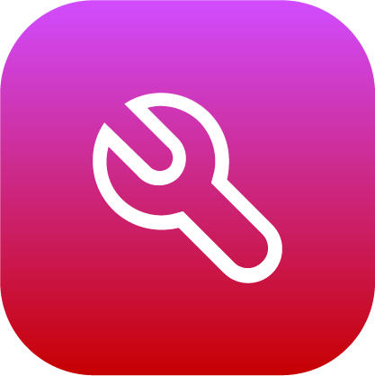

# Adding a Robot

Before adding a robot to the Device Library, install the robot and robot controller following vendor instructions. Go to **ready-robotics.com** to find a startup guide for your robot controller.

1.  In the Device Library, select the type of robot that you are using. Then tap **NEXT**.

    

2.  Type in a ​**Device Name​** and the device **​​IP Address**. A **Description** is optional. Then select your ​**Robot** ​and **Controller**​ models. If you are using a force sensor device, select it from the dropdown. The dropdown lists force sensor devices that are already configured on the ForgeOS system.

    **Note:** The force sensor selection applies **only** to a force sensor that is attached to the end of the robot arm. If you are using a force sensor device elsewhere in the workcell, set that up as a separate device unrelated to the robot arm.

    

3.  For some robot brands, you may see a prompt to insert a 2GB USB flash drive. If you do, insert a flash drive into your IPC and follow READY startup instructions to transfer files to the robot. Find vendor-specific start up guides on READY’s Support page at**ready-robotics.com**.

    

    **Important:** Each time you update ForgeOS, you should update the robot configuration files. For robots that need configuration files, follow update instructions at ready-robotics.com.

4.  Tap **SAVE**. Wait for ForgeOS to connect with the robot.

    **Note:** The SAVE button is only available when all required fields are filled in.

5.  Add all the **Tool Center Points \(TCPs\)** and **Payloads** that you expect to use in your task. Select one TCP and one Payload to be **Active on Boot** \(which means that they will be automatically selected when you log in\).

    **Note:** Return to this screen at any time after device setup to add, modify, and remove TCPs and Payloads.

    **Note:** Some robots require an extra tool loading procedure on the native robot pendant to resolve errors after adding, modifying, and removing TCPs and Payloads on the READY pendant. Refer to the knowledge base at ready-robotics.com.

    **Note:** You can add a maximum of 100 TCPs and Payloads.

    

    1.  The TCP is the exact translational and rotational difference between the robot tool flange \(default TCP\) and the tip of the end effector. To add a TCP, tap **NEW +** at the top-right corner of the TCP table. Enter a name. Then enter the translational and rotational offset values relative to the default TCP. Look at the robot rendering in the left side panel for reference. Rotate the view by dragging one finger across the window. Zoom in or out by using two fingers on the window in a pinching motion.

        **Note:** The default TCP is at the robot's tool flange.

        

        **Note:** The values for X, Y, and Z represent the TCP's position with respect to the default TCP in Cartesian coordinates. RX, RY, and RZ represent the TCP's rotational offset from each of the axes on the default TCP. To find the rotational offset values, find the rotation needed around the original X-axis \(RX\). Then find the rotation needed around the original Y-axis \(RY\). Last, find the rotation needed around the original Z-axis \(RZ\).

        **Tip:** Use your right hand to visualize XYZ coordinates and to find the direction of positive rotations. Point your thumb in the direction of the positive axis \(direction of the arrow\). The direction that your fingers curl is the positive direction of rotation.

        |||

    2.  The payload is the mass and center of gravity position relative to the robot’s default TCP. To add a payload, tap **NEW +** at the top-right corner of the payload table. Enter a name and the mass and offset values relative to the tool flange. Look at the robot rendering in the left side panel for reference. The payload is represented by a sphere at the coordinates you enter. The larger the mass, the larger the sphere.

        **Note:** The default payload is a mass of zero, with the center of mass at the flange.

        

    3.  Tap **NEXT**.

6.  If you have devices wired into your robot controller's Input/Output \(I/O\) signals, follow these substeps:

    **Note:** Return to this screen at any time \(by selecting the device in Device Configuration and tapping **Edit**\) to modify I/O configuration.

    

    1.  Enter a **Display Name** \(i.e. “Open Machine Door”, “Open Pneumatic Vise”, or “Start Machining Cycle”\) to show what each configured signal does.

    2.  If you want a signal to appear in the device's Device Control page, tap the **DCP** checkbox next to that signal.

    3.  Tap **SAVE**.

7.  ForgeOS returns to the Device Configuration home screen. Make sure that your robot appears on the configured devices list and that it is ​**enabled**​.

    

**Parent topic:**[Device Configuration](../4-Device-Configuration-App/device_configuration.md)

