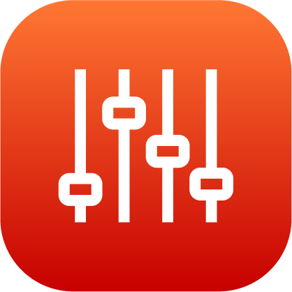

# Controlling a Clamping Gripper

The clamping gripper panel lets you open the gripper, close the gripper, or relax the gripper. The relaxed state does not apply any force to close or open. The controls are set by the device's configuration.

If you add gripper sensors to the gripper's configuration, then the indicators below the control buttons show the state of those sensor signals. If the sensors are installed and configured correctly, a green circle indicates when one of the sensors is activated.

**Parent topic:**[Device Control](../5-Device-Controls-App/device_control_panel.md)

