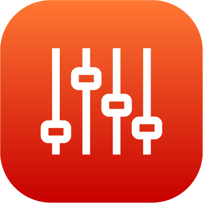

# Controlling a Robotiq Adaptive Gripper

When you select a Robotiq adaptive gripper to control, the app shows the gripper position status and controls.

To fully open the gripper, tap **OPEN GRIPPER**. To fully close the gripper, tap **CLOSE GRIPPER**.

Choose how far the gripper opens/closes, how fast it opens/closes, and how much force it uses to open/close. Enter values into the **Position**, **Velocity**, and **Force**boxes. Then tap **SET POSITION** to move the gripper with the set parameters.

**Parent topic:**[Device Control](../5-Device-Controls-App/device_control_panel.md)

